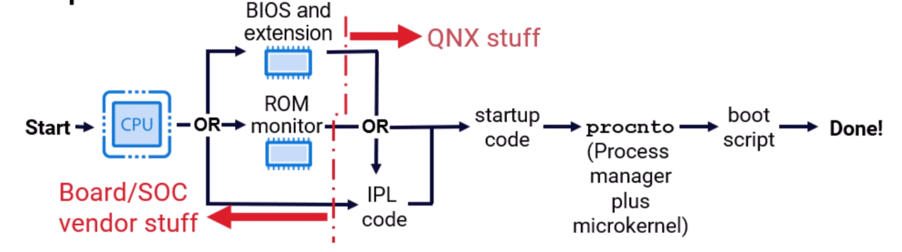

# QNX Architecture

## The Microkernel

### The microkernel handles the following

1. scheduling
2. (inter)-processor interrupts (IPI) -- IPI thread
3. processor exceptions
4. interprocess communication
5. kernel calls -- in user thread
6. resource management
7. timer
8. idle thread

### The three thread always running in the microkernel per processor

1. IPI
2. clock interrupts
3. idle thread

### Threads in running kernel code CAN be pre-empted

## Scheduling

1. Scheduling is per thread
2. higher priority pre-empts lower priority
3. priority is from 0~255
4. priority 0, 254, 255 are reserved by system

### Thread states

- Runnable
  - Running
  - Waiting
- Blocked

### Cluster

A cluster is:

- a set of related CPU cores
- Defined by the startup code in the BSP
- Something used to specify where a thread is allowed to run

## Process Manager

procnto is QNX

- proc for the process manager
- nto for neutrino micro kernel
- they share the same memory space, but behaves differently (TODO: process manager not running in elevated privilege?)
- the process manager is reached using messages

### Process Manager is responsible for

1. packaging of groups of threads together into processes
   1. process creation and termination
      1. posix_spawn / fork / exec
      2. loads ELF executables
2. memory management: memory allocation, address space management
   1. shared memory
3. pathname management
   1. in QNX, this is process location
4. several resource managers
   1. /proc
   2. /dev/shmem
   3. /dev/sem
5. system state notifications
6. system information

### Memory management: Virtual address model

1. to access physical (hardware) memory addresses, you must create a virtual mapping
2. all the processes share the underlying physical memory address space.
3. user space is 0-512GB
4. kernel is 512GB+
5. this makes kernel calls cheaper

### pathname management

1. When QNX Neutrino starts up, all pathname spaces are owned by the process manager.
2. Any request for file or device pathname resolution are handled by the process manager.

## Resource manager

### What is a resource manager

- A program that looks like it is extending the operating system by:
  - Creating and managing a name in the pathname space
  - Providing a POSIX interface for clients (e.g. oen(), read(), write(), ...)
- Can be associated with hardware (such as a serial port, or disk drive)
- Or can be a purely software entity (such as `mqueue`, the POSIX queue manager)

### Opening a resource manager

1. Client's library (open()) sends a "query" message to `Process Manager`
2. `Process Manager` replies with who is responsible
3. Establish connection and send open message
4. Resource manager responds with status (pass/fail)

### Further communication

Further communication is message passing directly to the resource manager.

### Other notes

- this setup allows for a lot of powerful solutions
  - Provide resiliency or redundancy of OS services
  - drivers are processes, so you can:
    - debug "OS" drivers with a high-level (symbolic) debugger
    - export access to your custom driver with a network file system such as NFS or CIFS
- the ONX C library provides a lot of useful code to minimise the work needed to write a resource manager

## System Libraries

### Many standard functions in the library are built on kernel calls

- usually this is a thin layer, that may just change the format of arguments, e.g.
  - the POSIX function `timer_settime()` calls the kernel function `TimerSettime()`
    - it changes the time values from the POSIX seconds & nanoseconds to the kernel's 64-bit nanosecond representation
- we recommend using the standard calls
  - your code is more portable
  - you use calls that are going to be more familiar to and readable by your developers

### But QNX is a microkernel

- so many routines that would be a kernel call, or have a dedicated kernel call in a traditional Unix become a message pass
- they build a message then call MsgSend passing it to a server, e.g.
  - `read()` builds a message then sends it to a resource manager
  - `fork()` builds a message and sends it to the process manager

## Shared Objects

- are libraries loaded and linked at run time
- one copy used (shared) by all programs using library
- also sometimes called DLLS
  - shared objects and DLLs use the same architecture to solve different problems

## OS services

### QNX is a microkernel

- most system services are delivered by a process
- if you want the service, you run the process
  - if you don't want/need the service, you don't pay the code and data overhead for the service
- services can be dynamically configured/removed as needed

`pidin` is a system tool that list process in QNX systems.

### Some of the service/processes are

| app        | desc                                |
| ---------- | ----------------------------------- |
| random     | Supply random numbers               |
| mqueue     | POSIX message queues IPC            |
| dumper     | Core dump creation                  |
| pipe       | Unix pipes                          |
| devb-*     | Filesystems, usually rotating media |
| devf-*     | Filesystems, NOR flash              |
| io-sock    | TCP/IP stack                        |
| slogger2   | QNX system logger                   |
| pci-server | PCI bus access and configuration    |

## Boot Sequence

- IPL (initial program load) code:
  - does chip selects and sets up RAM, then jumps to startup code
- startup code:
  - sets up some hardware and prepares environment for procto
- procnto:
  - sets up kernel and runs boot script
- the boot script contains:
  - drivers and other processes, including yours

### The `startup` code

The startup code:

- is board-specific
- tells procnto about core hardware, e.g.:
  - system RAM amount and layout
  - interrupt controller(s)
  - timer chip(s)
  - special memory regions (e.g. graphics memory)
  - clusters
- communicates this data through the system page (syspage)
  - mapped read-only into every process

## Security - Permissions

QNX uses Unix style permissions:

- for files, directories, and devices
- user/group/other for read, write, and execute/search
- from the boot image (ifs, image file system), everything runs as root (uid 0)
  - this can be changed with:
    - launcher programs
    - login
    - `setuid()` and related C APIs
    - `setuid` executables
- qconn runs, and launches, everything as root by default
  - should never be running on a released system

Controlling system privileges:

- system privileges, e.g.:
  - changing user id
  - killing other user's processes,
  - accessing hardware
- traditionally controlled on a root/non-root basis
- QNX uses procmgr abilities for finer-grained control
  - ability defaults differ for root and non-root processes
  - for backwards compatibility, root (uid 0) defaults to having all abilities
  - can be controlled through the procmgr_ability function
- but, use security policies instead...

On secured systems, system privilege is controlled by security policies:

- policy is written & compiled on host
  - we recommend starting with a generated policy
- the compiled policy is loaded into kernel at boot time
- defines process types
  - what abilities a process type has
  - what transitions (to other types) are allowed
- during system initialization, all process are started with a type
- separates system privileges (type, abilities) from file/device/directory access (uid, gid)

## Conclusion

- QNX is a microkernel architecture OS
- most OS services are delivered by cooperating processes
- processes own resources and threads run code
- drivers are processes
- QNX does preemptive scheduling
  - only READY threads are schedulable, blocked threads are not
