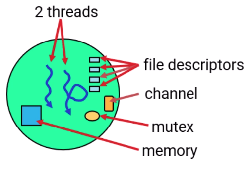
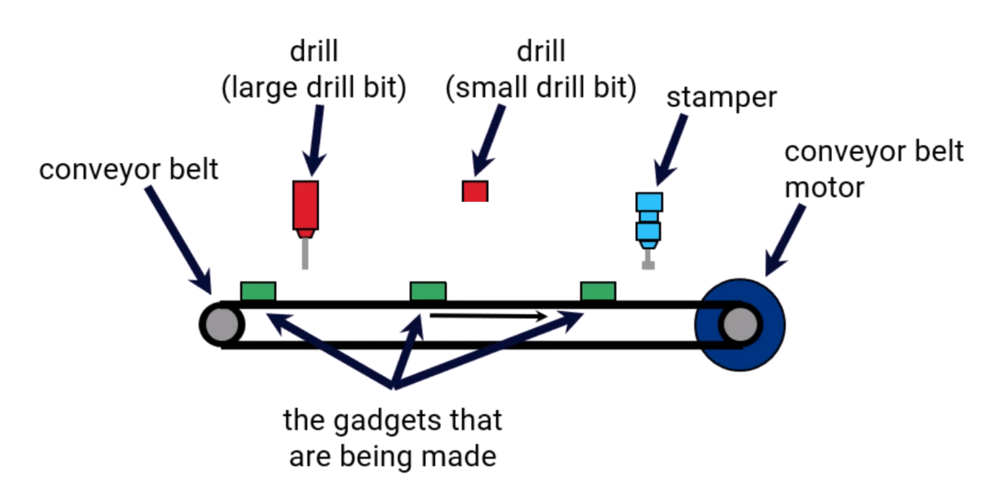
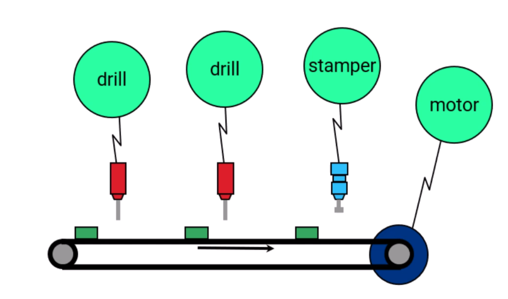
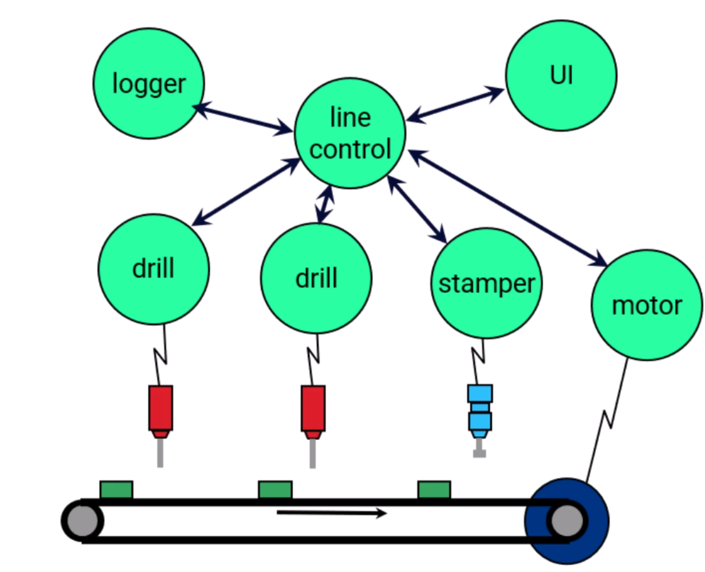
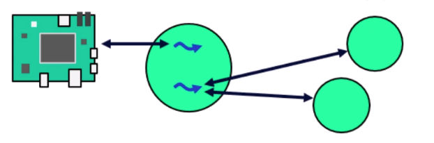
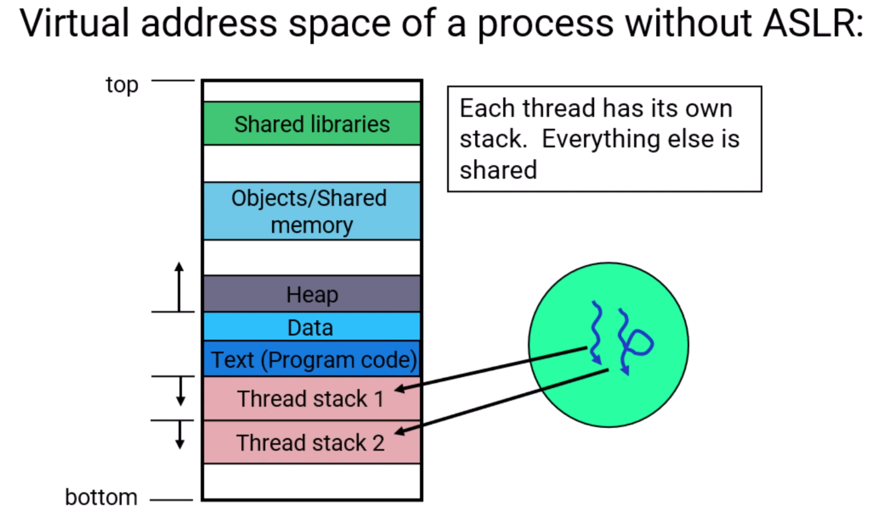
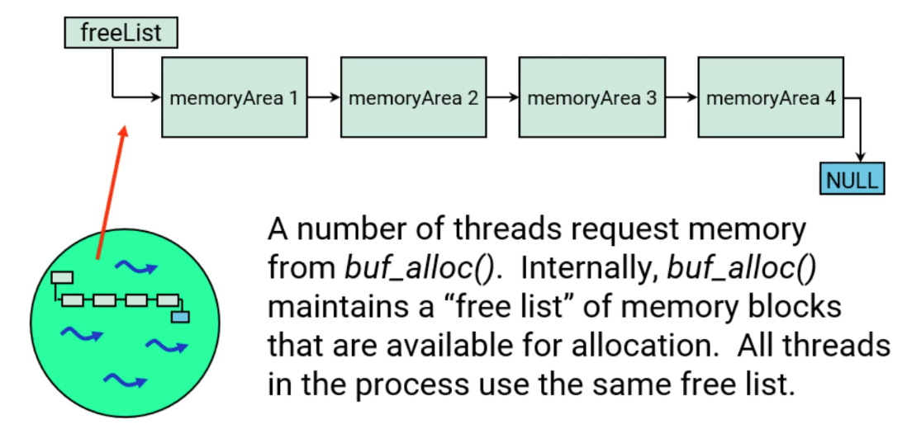
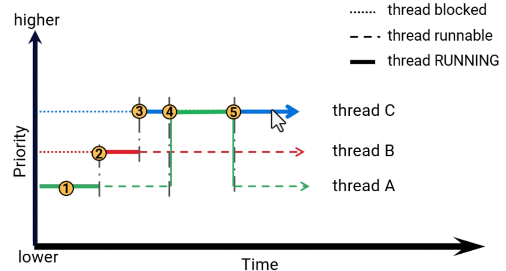
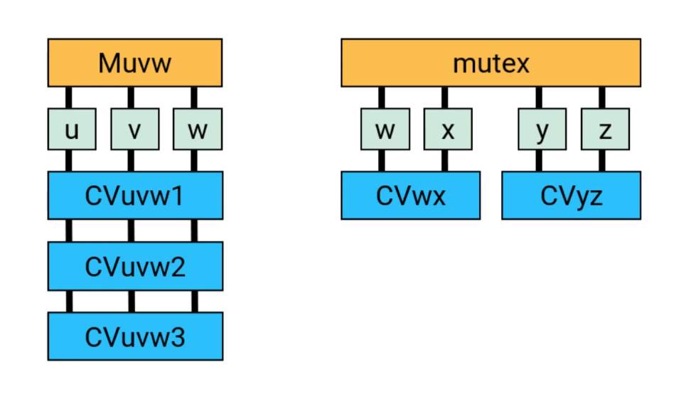

# Process, Threads and Synchronization

## Process and Threads

### Process

What is a process?



- a program loaded into memory
- identified by a process id, commonly abbreviated as pid
- owns resources, e.g.:
  - memory, including code and data
  - open files
  - timers
- security context:
  - identity: user id, group id
  - type id and abilities

Resources owned by one process are protected from other processes

### Thread

What is a thread?

- a thread is a single flow of execution or control
- a thread has some attributes:
  - priority
  - scheduling algorithm
  - register set
  - CPU mask for multicore
  - signal mask
  - and others
- all its attributes have to do with running code

Threads run in a process:

- a process must have at least one thread
- threads in a process share all the process resources

Threads run code, processes own resources

### Example - Assembly line

Components:


One process for each component:


Control and other processes:


### Designing with Threads - Process opacity

Process opacity:

- one process should not be aware of the threads in another process
  - threads are an implementation detail of the process that they are in
- why?
  - object oriented design - the process is the object.
  - flexibility in how processes are written - it might use only one thread, it might use multiple threads, the threads may be dynamically created and destroyed as needed, ...
  - scalability and configurability - if clients find servers using names then servers can be moved around. Intermediate servers can be added, servers can be scaled up or down by adding or removing threads

Some examples of multithreaded processes:

- high priority, time-critical thread dedicated to handling hardware requests as soon as they come in; other thread(s) that talk to clients <br/>


- pool of worker threads. If one or more threads are busy handling previous requests there are still other threads available for new requests <br/>


### Virtual Address Space



ASLR: ASLR stands for Address Space Layout Randomization, a security technique used by operating systems to make memory-based attacks more difficult by randomizing the memory addresses where key system components are loaded.

### View a process's memory info in Momentics IDE

Connect to a target -> System Information -> select a process to view its memory layout

## Process Creation

There are a number of process creation calls:

- `fork()`
  - create a copy of the calling process
- `exec*()`
  - load a program from storage to transform the calling process
- `posix_spawn(), spawn*()`
  - load a new program creating a new process for it

### `fork()`

`fork()` will create a copy of your process:

- the child will:
  - be an identical copy of the parent
  - start from the `fork()`
  - initially have the same data as the parent
- `fork()` in a multi-threaded process is best avoided
- `fork()` returns child's pid for the parent and 0 for the child
  - child does not inherit threads -- it only 

``` C++
pid = fork ();
if (pid > 0) {
  // parent does this section
} else if (pid = 0 ) {
  // child does this section
} else {
  // error return to parent
}
```

What resources get inherited?

- inherited:
  - file descriptors (fds)
  - any thread attributes that inherit (e.g. priority, scheduling algorithm, signal mask, io privilege)
  - uid, gid, type id
  - address space is replicated
- not inherited:
  - side channel connections (coids)
  - channels (chids)
  - timers

### `exec*()`

The `exec*()` family of functions replace the current process environment with a new program loaded from storage

- process id (pid) remains the same
- inheritance is mostly same as `fork()` except:
  - address space is created new
  - inheritance of file descriptors (fds) is configurable on a per fd basis
- arguments and environment variables may be passed to the new program
- these functions will not return unless an error occurs

### `posix_spawn()` and `spawn*()`

To run a new program:

- use `posix_spawn()` or the `spawn*()` calls
  - will load and run a program in a new process
  - will return the pid of the child process
  - inheritance rules follow that of `fork()` and then `exec*()`
- `spawn*()` are convenience functions
- `posix_spawn()` gives you more control
  - more complex to use
  - portable

### `fork()` & `exec()` vs `posix_spawn()`

Fork & exec vs spawn:

- fork and then exec is the traditional Unix way
  - portable
  - inefficient
  - very complex to do safely in a multi-threaded process
- spawn does this as a single operation
  - avoids the copy of the data segment,
  - avoids a lot of setup and initialization that will immediately get torn down again
  - fewer calls, fewer messages
  - posix_spawn is the recommended choice on QNX

## Detecting Process Termination

We'll consider three cases:

- detecting the termination of a child
  - this is the only behavior POSIX describes
- client-server relationship
- death pulse

### Detecting the termination of a child

When a child dies:

- the parent will be sent a `SIGCHLD` signal
  - `SIGCHLD` does not terminate a process
- the parent can determine why the child died by calling `waitpid()` or other `wait*()` functions
- if the parent does not wait on the child, the child will become a zombie
  - a zombie uses no CPU, most resources it owns are freed, but an entry remains in the process table to hold its exit status
  - `signal(SIGCHLD, SIG_IGN)` in the parent will prevent the notification of death and creation of zombies

### client-server relationship

If you have a client-server relationship:

- a server can get notification if any of its clients die
- a client can get notification if any of its servers die
- these apply for QNX message passing
- these notifications happen on death, but can happen otherwise as well
  - but only happen when the relationship between client and server is severed

### Death pulse

You may ask the OS to deliver a notification whenever a process dies:

- register for notification of process death with `procmgr_event_notify()`
- request `PROCMGR_EVENT_ PROCESS_DEATH` notification
- can request any type of event (signal, pulse, etc) but a pulse ("death pulse") is usually easiest

## Thread

QNX supplies (at least) three APls for dealing with threads:

- kernel functions
  - e.g. `ThreadCreate()`, `SyncMutexLock()`
- POSIX functions
  - e.g. `pthread_create()`, `pthread_mutex_lock()`
- C11 thread functions
  - e.g. `thrd_create()`, `mtx_lock()`
- the portable (POSIX, C11) functions are built on top of the kernel calls
- we recommend using the portable functions

### Thread Creation

To create a thread, use:

`pthread_create (pthread_t *tid, pthread_attr_t *attr, void * (*func) (void *), void *arg);`

Example:
`pthread_create (&tid, &attr, &func, &arg);`

- `func()`, often called the "thread function", is where the newly created thread starts executing your code
- this parameter is mandatory; all other parameters can be NULL
- on return from pthread_create, the tid parameter will contain the tid (thread id) of the newly created thread
- arg is miscellaneous data of your choosing to be passed to `func()`
- attr allows you to specify thread attributes such as what priority to run at, ...

Setting up thread attributes

``` c++
pthread_attr_t attr;
pthread_attr_init(&attr) ;
/*
  set up the pthread_attr_t structure
  ...
*/
pthread_create(&tid, &attr, &func, &arg);
```

- `pthread_attr_init()` sets the `pthread_attr_t` members to their default values
- we'll talk about some of the things you might set in the attribute structure

#### Functions for setting attributes

- initializing, destroying:
`pthread_attr_init()`, `pthread_attr_destroy()`
- setting it up: 
`pthread_attr_setdetachstate()`, `pthread_attr_setinheritsched()`,
`pthread_attr_setschedparam()`, `pthread_attr_setschedpolicy()`,
`pthread_attr_setstacksizel()`, ...

#### Setting priority and scheduling algorithm:

``` C++
struct sched_param param;
pthread_attr_setinheritsched(&attr, PTHREAD_EXPLICIT_SCHED);
param.sched_priority = 15;
pthread_attr_setschedparam(&attr, &param);
pthread_attr.setschedpolicy(&attr, SCHED_RR);
pthread_create(NULL, &attr, func, arg);
```

- scheduling policies available include:
  - SCHED_FIFO - first-in-first-out
  - SCHED_RR - round-robin
  - SCHED_SPORADIC - sporadic scheduler
  - SCHED_OTHER - same as round-robin
  - SCHED_NOCHANGE - keep same policy, but change parameters (e.g. priority)

#### You can control the thread's stack size:

- to set the stack size: `pthread_attr_setstacksize(&attr, size);`
  - this must be at least `PTHREAD_STACK_MIN`
  - this will be rounded up to a multiple of the page-size (4K)
  - a guard page will be allocated as well, but no RAM will be used for it
- this can be controlled with `pthread_attr_setguardsize()
- the default stack size for new threads is 256K (plus a 4K guard page)
  - the "main" thread gets a 512K stack by default

### Thread Operations

#### Some thread operations:

``` c++
pthread_exit(retval)          // terminate the calling thread
pthread_join(tid, &retval)    // wait for thread to die & get return value
pthread_kill(tid, signo)      // set signal signo on thread tid
pthread_cancel(tid)           // cancel a thread - request that it terminate
pthread_detach(tid)           // make the thread detached(i.e. unjoinable)
int tid = pthread_self()      // find out your thread id
// QNX uses 0 as an alias for self thread ID.
pthread_setname_np()          // name your thread
```

#### Set/get priority and scheduling algorithm

- setting:

``` C++
struct sched_param param;
param. sched_priority = new_value;
pthread setschedparam (tid, policy, &param);
```

- getting:

``` C++
int policy;
struct sched_param param;
thread_getschedparam(0, &policy, &param);
printf("my priority is 8d\n", param.sched_priority);
```

#### Waiting for threads to die & finding out why

- if a thread is "joinable" then you can wait for it to die

``` C++
pthread_create (&tid, …., worker_thread, …..);
// at this point, worker_thread is running
// ... do stuff
// now check if worker_thread died or wait for Il it to die if it hasn't already
pthread_join (tid, &return_status);
```

- if it dies before the call to `pthread_join()` then `pthread_join()` returns immediately and `return_status` contains the thread's return value or the value passed to `pthread_exit()`
- Threads doesn't have parent/child relationship. thread 2 can join thread 1 even if thread 1 creates thread 2.
- once a `pthread_join()` is done, the information about the dead thread is gone
- `pthread_join()` returns error if the thread is already joined.

### Thread termination and clean up

- threads may self-terminate:
  - thread is self-terminating, so should clean up first as needed
  - calls `pthread_exit(void *return_val)`
    - another thread in the process can get the `return_val` with `pthread_join`
  - returns from the thread function (not `main()`)
    - the wrapping (libc) code will call `pthread_exit()`
- a thread may terminate another thread in the process:
  - `pthread_cancel()` requests that the thread die
    - may be delayed, or have a clean-up handler
  - `pthread_abort()` kills the thread immediately
- `pthread_kill()` does not kill a thread, it sends a signal to the thread. Either:
  - the signal is masked, ignored, or handled
  - OR kills the entire process

#### Synchronous termination is better than cancellation:

- use a flag
- thread checks flag, cleans up and exits, e.g.

``` C++
volatile boolean done = false;
void *thread_func (void *data) {
  /*
    setup code
  */

  while (!done) {
    block_to wait_for_events () ;
    do work () ;
  }

  /*
    clean up code
  */
}

// some other thread tells the thread to exit:
done = true;
```

#### The clean up

- unlock any mutexes locked by the thread
- release any resources only the thread knows about, e.g:
  - allocated memory
  - opened file descriptors or FILE streams
- the thread's stack will automatically be released (unmapped)
  - unless it is the `main()` thread
- important things like arguments and the environment data are stored in its stack
  - so, the main thread should be a "permanent" thread of your process

## Process Termination and clean up

### Two types of process clean up

- internal cleanup
  - code in the process may run to clean things up internally
- external cleanup
  - the operating system cleans up resources owned by the process

### For internal cleanup, C/C++/Unix systems differentiate between:

- normal termination:
  - `exit()` was called either explicitly or implicitly (i.e. by returning from `main()`)
  - internal cleanup, sometimes called "normal exit processing", happens including
    - `atexit()` handlers run
    - stdio/stream buffers flushed
    - global destructors run
- abnormal termination:
  - process died due to:
    - thread count going to 0 due to thread termination (e.g. `thread_exit()`), cancel, abort
    - crash (e.g. `SIGSEGV`)
    - unhandled signal (e.g. `kill pid`)
  - internal cleanup does not happen

### External cleanup is done by the OS:

- all process-owned resources are cleaned up, including:
  - all file descriptors are closed
  - all memory mappings are unmapped
    - this is how stack, heap, code, data, etc are freed
  - all timers are deleted
- resources that have names (pathnames) associated with them will survive process death, e.g.
  - regular files (`open()`)
  - shared memory objects (`shm_open()`)
  - named semaphores (`sem_open()`)
  - POSIX message queues (`mg_open()`)
- named objects must be unlinked, to be cleaned up, e.g.:
  - `unlink()`, `shm_unlink()`, `sem_unlink()`, `mq_unlink()`

## Synchronization - introduction

Which thread gets the protected object?

- when you release a synchronization object, e.g.:
  - post a semaphore with `sem_post()`
  - unlock a mutex with `pthread_mutex_unlock()`
  - signal a condition variable with `thread_cond_signal()`
  - unlock a reader/writer lock with `pthread_rwlock_unlock()`
- if there are multiple waiting (blocked) threads, which thread gets chosen?
  - the highest priority waiting thread
  - if multiple at that highest priority, the one that was waiting the longest

## Mutex

### POSIX provides the following calls:

- administration: `pthread_mutex_init(pthread_mutex_t *, pthread_mutexattr_t *);`, `pthread_mutex_destroy(pthread_mutex_t *);`
- usage: `pthread_mutex_lock(pthread_mutex_t *);`, `pthread_mutex_unlock(pthread_mutex_t *);`

### What do the mutex calls do?

- `pthread_mutex_lock()`
  - if the mutex is unlocked, mark as locked by calling thread and return EOK (success)
  - else if the mutex is already locked by the calling thread, return EDEADLOCK
  - otherwise, block until the mutex is unlocked
- `pthread_mutex_unlock()`
  - if the mutex is locked by the calling thread unlock the mutex
    - if there are one or more threads blocked, unblock the appropriate thread
      - highest priority; longest waiting at highest priority if multiple
  - else return EPERM
- **Note: only the thread that locked a mutex can unlock it**

### A simple example

``` C++
pthread_mutex_t myMutex;

init() {
  // create the mutex for use
  pthread_mutex_init(&myMutex, NULL) ;
  // ...
}

thread_func() {
  // ...
  // obtain the mutex, wait if necessary
  pthread_mutex_lock(&myMutex) ;
  // critical data manipulation area
  // end of critical region, release mutex
  pthread_mutex_unlock(&myMutex) ;
  // ...
}

cleanup() {
  pthread_mutex_lock(&myMutex) ;
  pthread_mutex_destroy(&myMutex) ;
}
```

### Consider a buffer allocation tool, buf_alloc()



`buf_alloc()` source might look something like this:

``` C++
void *buf_alloc(int nbytes) {
  while (freelist && freelist -› size != nbytes) {
    freelist= freelist -> next;
  }
  if (freeList) {
    // mark block as used, and return block address to caller
    // ...
    return (freelist->memory_block)
  }
}
```

Thread safe version of `buf_alloc()`:

``` C++
pthread_mutex_t alloc_mutex;

void *buf_alloc(int nbytes) {
  // ...
  pthread_mutex_lock (&alloc_mutex) ;
  while (freelist && freelist->size != nbytes) {
    freeList = freeList -> next;
  }
  if (freeList) {
    // ...
    // mark block as used, and return block
    block = freeList-> memory_block;
    pthread_mutex_unlock(&alloc_mutex) ;
    return block;
  }
  pthread_mutex_unlock (&alloc_mutex) ;
  return nullptr;
  // ...
}
```

### mutex usage

To explicitly initialize the mutex:

`pthread mutex_init(&alloc_mutex, NULL);`

- for default mutexes in the ONX implementation, this will never fail
- for certain mutex types requested by the attribute structure (if not NULL), this will may request a kernel resource, and may fail
  - e.g. robust mutexes

A simple method for mutex initialization:

``` C++
// static initialization of Mutex
pthread_mutex_t alloc_mutex = PTHREAD_MUTEX_ INITIALIZER;
void *buf_alloc(int nbytes)
{
  // ...
  // mutex allocated on first use
  pthread_mutex_lock(&alloc_mutex);
}
```

When working with shared memory, you likely need to protect the shared data:

- to use a mutex to protect shared memory:
  - initialize a mutex in the shared memory
  - set the `PTHREAD_PROCESS_SHARED` flag for that mutex
— e.g.:

``` C++
pthread_mutexattr_t mutex_attr;
pthread_mutex_t *mutex;
pthread_mutexattr_init(&mutex_attr);
pthread_mutexattr_setpshared(&mutex_attr, THREAD_PROCESS_SHARED);
mutex = (pthread mutex_t *)shmem_ptr;
pthread_mutex_init(mutex, &mutex_attr);
```

### deadlock

- Description: Ignored
- Solution:
  - establish a locking hierarchy that specifies the order in which threads acquire mutexes. Ensure that all threads acquire the mutexes in the specified order to avoid deadlock

### Priority Inheritance

Threads with a mutex locked can have their priority temporarily boosted.



### Designing with Mutexes - Mutex Locked time

Keep mutexes locked for short periods

- keep a mutex locked for as short a time as reasonable
- while one thread has the mutex locked, other threads that want the resource protected by the mutex have to wait
  - the thread may spend time doing work at a higher than normal priority
- with ONX there is the added benefit that if the mutex is not locked, and you try to lock it, the amount of code you'll end up doing is very short and very fast...

Behind the scenes

Uncontested `pthread_mutex_lock()` is very efficient:

this is not the exact code, but illustrative

``` C++
int pthread_mutex_lock(pthread_mutex_t *mutex) {
  // atomic operation to check if it is unlocked.
  if (mutex smp_upxchg(&mutex -> owner, 0, thread_id) == 0) {
    // Uncontested Access, Fast!
    return EOK;
  }
  // not the fast path, so make the kernel call, more overhead
  return SyncMutexLock_r(mutex);
}
```

- `pthread_mutex_unlock()`, similarly, does a local test to see if any threads are waiting on the mutex, and only calls the kernel if necessary.

## Condition Variables

### Concepts

ignored

### Usage (POSIX)

The condvar calls:

- administration: `pthread_cond_init(pthread_cond_t *, pthread_condattr_t *);`, `pthread_cond_destroy(pthread_cond_t *);`
- usage: `pthread_cond_wait(pthread_cond_t *, pthread_mutex_t *);`, `pthread_cond_signal(pthref_cond_t *);`, `pthread_cond_broadcast(pthread_cond_t *);`
- As with mutexes, condvars can be used in shared memory by setting the `PTHREAD_PROCESS_SHARED` flag in the attribute structure

### What do the condvar calls do?

- `pthread_cond_wait()`
  - as a logically atomic operation, unlock the mutex and block on the condition variable
  - when unblocked from the condvar, lock the mutex and return
- `pthread_cond_signal()`
  - if one or more threads are blocked on condition variable, unblock the appropriate thread
    - the highest priority; longest waiting at highest priority if multiple
  - otherwise, do nothing (notification is not remembered)
- `pthread_cond_broadcast()`
  - if one or more threads are blocked on condition variable, unblock all of them
    - one will lock the mutex and return, the rest will end up waiting in turn for the mutex
  - otherwise, do nothing (again, notification is not remembered)

### Signalling vs broadcasting

- Threads 1, 2 and 3 (all at the same priority) are waiting for a condvar via `pthread_cond_wait()`
- Thread 4 makes a change, signals the variable via `pthread_cond_signal()`,
- The longest waiting thread (let's say "2") is informed of the change, and tries to acquire the mutex (done automatically by the `pthread_cond_wait()`),
- Thread 2 tests against its condition, and either performs some work, or goes back to sleep

What about threads 1 and 3?

- they never see the signal!

If we change the example:

- use `pthread_cond_broadcast()` instead of `pthread_cond_signal()`
  - then all three threads will get the signal
  - they wil all become runable, but only one can lock the mutex at a time

Why use one over the other?

- use a signal if:
  - you have only one waiting thread, or
  - you need only one thread to do the work and you don't care which one
- use a broadcast if you have multiple threads and:
  - they all need to do something, or
  - they don't all need to do something but you don't know which one(s) to wake up

### Designing with condvars and mutexes

The association need not be one-to-one



## Atomic Operations

For short operations, such as incrementing a variable:

``` C++
atomic_add()        // does += some value
atomic_clr()        // does &= ~some value
atomic_set()        // does |= some value
atomic_sub()        // does -= some value
atomic_toggle()     // does ^= some value
does += some value does &= ~some value
does = some value
does -= some value does ^= some value
```

These functions:

- all have an `atomic_<operation>_value()` form that does the operation and returns the **original** value
- are guaranteed to complete correctly despite pre-emption or interruption, and between cores
- can be used between two threads (even on SMP)
- can be used between a thread and an ISR

QNX also supports the C11 atomic functions and types

- they are more portable, but more complex to use
