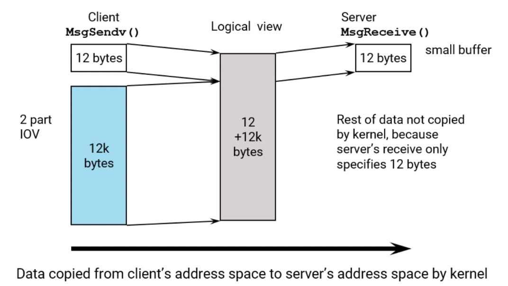

# Interprocess Communication

## Message passing

### QNX Native IPC

- client-server based
- bidirectional communication


### QNX Native IPC is

- a remote procedure call architecture
  - server thread runs at client priority
- fully synchronous
  - when idle, server is blocked waiting for message
  - client blocks until server


### CASE 1: Send after Receive - blocked/idle server


### CASE 2: Send before Receive - busy server


### Channels and Connection


#### Multiple Connection and Channels

- a client may have connections to several servers
- a server uses a single channel to receive messages from multiple clients


### Server pseudo-code


### Client pseudo-code


### Server code

The server creates a channel using:
`chid = ChannelCreate(flags);`


- a channel is attached to a process
- any thread in the process can receive messages from the channel if it wants to
- when a message arrives, the kernel simply picks a (*M*???) thread to receive it
- flags is a bitfield.

#### Some of the `ChannelCreate()` flags

- `_NTO_CHF_PRIVATE`
  - a channel for a process' internal use
  - to create a public channel your proces must have the `PROCMGR_AID_PUBLIC_CHANNEL` ability
- `_NTO_CHE_COID_DISCONNECT`
  - notify when any connection (coid or fd) belonging to the process that owns the channel becomes invalid
- `_NTO_CHF_ DISCONNECT`
  - notify when a client process goes away
- `_NTO_CHE_UNBLOCK`
  - notify when a client thread needs to be unblocked

### Client code

The client connects to the server's channel: `coid = ConnectAttach(0, pid, chid, _NTO_SIDE_CHANNEL, flags);`

- pid, chid uniquely identify the server's channel
  - pid is the process id of the server
  - chid is the channel id
  - always pass _NTO_SIDE_CHANNEL for the 4th parameter

### Connection IDs (coids) come in two types


- when calling `ConnectAttach()` yourself (as opposed to a lib function calling it) you do not want your coid to be in the file descriptor range
- passing _NTO_SIDE_CHANNEL prevents it

#### To get a listing of executing threads/processes (using the IDE)

- open the System Information Perspective
- select a process in the Target Navigator
  - you can select multiple by holding down CTRL key, e.g. select server and client
- the Process Information view will show states of server and client
- the Connection Information view will show the connections (file-descriptor and side-channel) of a process
  - turn on Full Side Channels in the View Menu to see the actual values of the side-channel
connections

#### To get a listing of file descriptors, using the command-line

`pidin fd`

#### To get a listing of executing threads/processes (using the command-line)

`pidin`


### The `MsgSend()` call (client)

`status = MsgSend(coid, &smsg, sbytes, &rmsg, rbytes);`

- `coid` is the connection ID
- `smsg` is the message to send
- `sbytes` is the number of bytes of smsg to send
- `rmsg` is a reply buffer for the reply message to be put into
- `rbytes` is the size of rmsg
- `status` is what will be passed as the `MsgReply*()`'s status parameter

### The `MsgReceive()` call (server)

`rcvid = MsgReceive(chid, &rmsg, rbytes, &info);`

- `chid` is the channel ID
- `rmsg` is a buffer in which the message is to be received into
- `rbytes` is the number of bytes to receive in rmsg
- `info` allows us to get additional information
- `rcvid` allows us to MsgReply*() to the client

### The `MsgReply()` call (server)

`MsgReply(rcvid, status, msg, bytes);`

- `rcvid` is the receive ID returned from the server's `MsgReceive*()` call
- `status` is the value for the MsgSend* to return, do not use a negative value
- `msg` is reply message to be given to the sender
- `bytes` is the number of bytes of msg to reply with

### The `MsgError()` call (server)

- will cause the MsgSend*() to return -1 with errno set to whatever is in error.

`MsgError(rcvid, error);`

- `rcvid` is the receive ID returned from the server's `MsgReceive*()` call
- `error` is the error value to be put in errno for the sender

### Server Example

``` C++
#include <sys/neutrino.h>

int main (void) {
  int chid;
  rcvid_t rcvid;
  mymsg_t msg;

  // ...

  chid = ChannelCreate(0);
  while (1) {
    rcvid = MsgReceive(chid, smsg, sizeof(msg), NULL);
    
    // ... perform processing on message/handle client request
    
    MsgReply(rcvid, EOK, &reply_msg, sizeof(reply_msg));
  }

  return 0;
}
```

### Client Example

``` C++
#include <sys/neutrino.h>

int main(void) {
  int coid; //Connection ID to server
  mymsg_t outgoing_msg;
  int server_pid, server_chid, incoming_msg;

  coid = ConnectAttach(0, server pid, server _chid, _NTO_SIDE_CHANNEL, 0);
  MsgSend(coid, &outgoing_msg, sizeof(outgoing_msg), &incoming_msg, sizeof(incoming_msg));

  // ...
  return 0;
}
```

### The message data

#### Message data is always copied

- the kernel does not pass pointers


- the number of bytes actually transferred is the smaller of the client buffer size and the server buffer size

#### A server can reply with no data

- this can be used to unblock the client, in cases where you only need to give a status/acknowledgement back to MsgSend
- client knows the status of its request


## Designing a Message passing System

### Avoid overlapping with QNX message range

- These are the messages generated by QNX system library routines, like `read()`, `procmgr_event_notify()`
- All QNX messages starts with `uint16_t`
- QNX values are from `0` to `_IO_MAX` (512)
- assign a value that is greater than `_IO_MAX` to custom messages.

### On the server side

branch based on message types

``` C++
while (1) {
  rcvid = MsgReceive(chid, smsg, sizeof(msg), NULL);
  switch ( msg.type ) {
  case MSG_TYPE_1:
    handle_msg_type_1(rcvid, &msg);
    break;
  case MSG_TYPE_2:
    // ..
  }
}
```

## Pulses

### Basics

- non-blocking for the sender
- fixed-size payload
  - 8-bit code (-128 to 127)
    - negative values reserved for system use
    - 7-bits available
  - 64-bit value
    - can be treated as pointer, long, or int
- unidirectional (no reply)
- fast and inexpensive


### Sending pulses

`MsgSendPulse(coid, priority, code, value);`

- `code` is 8 bit
- `value` is 64 bit
- `code` is usually used to mean "pulse type"
  - valid range is `_PULSE_CODE_MINAVAIL` (0) to `_PULSE_CODE_MAXAVAIL` (127)
- to send a pointer use `MsgSendPulsePtr()` instead
- priority indicates the priority the receiving thread should run at
  - QNX uses a priority inheritance scheme to minimize priority inversion problems
  - delivery order is based on priority
  - -1 can be used for the priority of the calling thread
- to send a pulse across process boundaries, the sender must have appropriate privilege
  - A pulse accross process boundaries must either share the same effective user id or have the `PROCMGR_AID_CONNECTION` ability

### Receiving a pulse

Pulses are received just like messages, with a `MsgReceive*()` call:

- a server can determine whether it has received a pulse vs. a message by the return value from `MsgReceive()`
  - the return value will be >0 if a message was received.
    - this value will be the `rcvid`, which will be needed to `MsgReply()`
  - the return value will be == 0 if a pulse was received
    - you can not `MsgReply()` to pulses
- the pulse data will be written to the receive buffer
  - the receive buffer must be large enough to hold the pulse structure (24 bytes), if not:
    - the return value will be == -1, and errno will be `EFAULT`
    - the pulse will be lost

### Pulse queueing

- by default, pulses are queued until the system runs out of memory
  - this may be a concern due to:
    - dropped pulses from places where failure isn't detectable
    - draining of system memory because of poor server behaviour
- the solution is to pre-allocate the pulse queue for a channel:

``` C++
struct nto_channel_config ch_config = {.num_pulses = NUM_PULSES,};
chid = ChannelCreatePulsePool(flags, &ch_config) ;
```

- if more than NUM_PULSES are queued without being received, then, by default, the process is killed
- Under the hood, QNX optimize the pulse queue buffer by colliding identical pulse into one entry (add a `count` field to the buffer)

### Receiving pulses

Use an union to receive both messages and pulses

``` C++
typedef union {
  struct_pulse pulse;
  // other message types you will receive
} myMessage t;

// ...
myMessage_t msg;
while (1) {
  rcvid = MsgReceive(chid, &msg, sizeof(msg), NULL);
  if (rcvid == 0) {
    // it's a pulse, look in msg. pulse... for data
    switch (msg.pulse.code) {
    case PULSE_TYPE_1:
      // ...
      break;

    case PULSE_TYPE_2:
      //...
      break;

    // ...
    }

  } else {
    // it's a regular message
  }
}
```

### Pulse structure

When received, the pulse structure has at least the following members:

``` C++
struct _pulse {
  _Uint16t      type;
  _Uint16t      subtype;
  _Int8t        code;
  _Uint8t       zero[3];
  union sigval  value;
  _Int32t       scoid;
};

union sigval {
  long    sival_long;
  void*   sival_ptr;
  int     sival_int;
};
```

We can get more info about calling client by passing scoid to some system function calls.

## Message Information

### Getting the information

To get information about the client, after receiving a message:

- info will be stored in this struct: `struct _msg_info info`;
- can get it during the `MsgReceive()`: `rcvid = MsgReceive (chid, rmsg, rbytes, &info);`
- or later, using: `MsgInfo(rcvid, &info);`
- this will not be updated if you receive a pulse
  - it will contain old (garbage) data

### `struct _msg_info`

The `_msg_info` structure contains at least:

``` C++
pid_t   pid;        // sender's process ID
int     tid;        // sender's thread ID
int     chid;       // channel ID
int     scoid;      // server connection ID
int     coid;       // sender's connection ID
short   priority;   // sender's priority
short   flags;      // A extra info
size_t  msglen;     // msg lengths
size_t  srcmsglen;  // msg lengths
size_t  dstmsglen;  // msg lengths
```

#### message size info


- the number of bytes copied (info.msglen) will be the smaller of what the client sent with `MsgSend()` and what the server received with `MsgReceive()`. Similarly for the reply.

#### Some uses for the `_msg_info` information

- `scoid` serves as a "client ID"
  - can be used as an index to access data structures on the server that contain information about the client
- client authentication
  - e.g. only certain client process are allowed to talk to this server
  - `ConnectClientInfo()` can be used to get further information (e.g. user id) about the client, based on the `scoid`
- message data copied verification
  - make sure data promised by (possibly untrusted) client headers has actually been copied
- reply space checking
  - how much data can I push back to the client?
- debugging and logging
  - the server may create usage logs or debug logs, and having the pid and tid logged may be useful

## How a Client Finds a Server

- for a client to send to a server it needs a connection ID (`coid`), i.e. `MsgSend(coid, &msg, ...)`
- as we've seen, to get a `coid`, a client can do `ConnectAttach()`, i.e. `coid = ConnectAttach(0, pid, chid, ...);`
- the problem is, how does the client know what the server's pid and chid are?
- our exercises had the server print out its pid/chid, and the client took them as command-line arguments
  - this doesn't work well as a general solution
- there are two other methods, depending on whether the server is:
  - a resource manager
  - a simple `MsgReceive()` loop
- both methods make use of the pathname space
  - server puts a name into the pathname space
  - both client and server must have an understanding of what that name will be
  - client does an 'open' on the name, and gets a `coid`

### If the receiver is a resource manager

- the resource manager attaches a name into the namespace: `resmgr_attach(..., "/dev/sound", ...);`
- the client does: `fd = open("/dev/sound", ... );`
- then it make use of the fd (recall that fd's are a particular type of coid)

``` C++
write(fd, ...);     // sends some data
read(fd, ...);      // gets some data
// OR
MsgSend(fd, ...);   // send data, get data back
```

### If the server is a simple `MsgReceive()` loop

- use `name_attach()` and `name_open()`
- The server does:

``` C++
name_attach_t *attach;
attach = name_attach(NULL, "myname", 0);
// ...  
rcvid = MsgReceive(attach->chid, &msg, sizeof(msg), &msg_info);
// ...
name_detach(attach, 0);
```

- The client does:

``` C++
coid = name_open("myname", 0);
// ...
MsgSend(coid, &msg, sizeof(msg), NULL, 0);
// ...
name_close(coid);
```

### `name_attach()` Under the hood

- `name_attach()` creates the channel for you
- internally it does a `ChannelCreate()`
- When doing so, it turns on several channel flags.
- the channel flags request that the kernel send pulses to provide notification of various events
- your code should be aware that it will get these pulses, and handle them appropriately

#### `ChannelCreate()` flags that `name_attach()` sets

- `_NTO_CHF_DISCONNECT`
  - requests that the kernel deliver the server a pulse when a client goes away
  - pulse will have code `_PULSE_CODE_DISCONNECT`
- `_NTO_CHF_COID_DISCONNECT`
  - requests that the kernel deliver the client a pulse when a server goes away
    - in this context, our server is also a client of another server
    - it is possible tor a client to have a channel, as we'll see later
  - pulse will have code `_PULSE_CODE_COIDDEATH`
  - value will be the coid/fd that has become invalid
- `_NTO_CHF_UNBLOCK`
  - requests that the kernel deliver a pulse if a REPLY blocked client wants to unblock
  - pulse will have code `_PULSE_CODE_UNBLOCK`

### per-client data

A server often needs to track per-client data:

- e.g. pending requests, configurations, notification requests
- should persist as long as client is associated with server
- needs to be cleaned up/released when client goes away
  - disconnect pulses tells us when the client has gone away
- so:
  - associate the data with the clients `msg_info.scoid`
  - on receiving a `_PULSE_CODE_DISCONNECT` pulse:
    - find the matching data based on the `pulse.scoid`
    - release the matching data
    - release the scoid by calling `ConnectDetach(pulse.scoid);`

### Example of a server receiving kernel pulses

``` C++
rcvid = MsgReceive(attach->chid, &msg, sizeof(msg), &msg_info);
if (rcvid == 0) {
  //did we receive a pulse?
  switch(msg.pulse.code) {
    //what kind of pulse is it?
  case _PULSE_CODE_DISCONNECT:
    //client disconnected
    release_client_data(msg.pulse.scoid);
    ConnectDetach(msg.pulse.scoid);
    // ...
    break;
  case // ...
  }
}
```

## Multi-part messaging

### The problem

- what if you wanted to transfer 3 large message parts?


- you could `malloc()` enough space to hold the complete message (750 + 500 +1000 KB = 2.25 MB)
- do three `memcpy()`s to produce one big message


### Using IOVs

- setting up a 3-part IOV, with pointers to the data, and using `MsgSendv()` is much more efficient
  - avoids the `malloc()` and t he `memcpy()`


- very useful for scatter/gather situations

IOVs are Input/Output Vectors

- array of pointers to buffers
— uses
  - avoiding copies when assembling messages containing multiple parts
  - variable length messages
    - server doesn't know the size of the message that the client will send
    - write messages to the filesystem driver/server use IOVs
- Instead of giving the kernel the address of one buffer using `MsgSend()`:

``` C++
MsgSend(int coid, void *smsg, int sbytes, void *rmsg, int rbytes);
//                      ^------- one buffer -------^ 
```

- we could give the kernel an array of pointers to buffers using `MsgSendv()`:

``` C++
MsgSendv(int coid, jov_t *siov, int sparts, iov_t *riov, int rparts);
//                        ^                         ^
//                        ^---- array of pointers to multiple buffers
```

- or a combination:

``` C++
MsgSendvs(int coid, iov_t *siov, int sparts, void *rmsg, int rbytes);
MsgSendsv(int coid, void *smsg, int sbytes, iov_t *riov, int rparts);
```

- What does an iov_t look like?

``` C++
typedef struct {
  void      *iov_base;
  size_t    iov_len;
} iov_t;
```

- Most useful as an array: `iov_t iovs[3];`
- make the number of elements >= the desired number of message parts
- each IOV element contains a pointer and a length
- macros to set values to IOV

``` C++
SETIOV (&iovs[0], &partl, sizeof(part1));
SETIOV (&iovs[1], &part2, sizeof(part2));
SETIOV (&iovs[2], &part3, sizeof(part3));
```

- When sent or received, these parts are considered as one contiguous sequence of bytes. This is ideal for scatter/gather buffers & caches...
- IOVs are used in the Messaging functions that contain a "v" near the end of their name: (`MsgReadv()`/`MsgReceivev()`/`MsgReplyv()`/`MsgSendv()`/`MsgSendsv()`/`MsgSendvs()`/`MsgWritev()`)

#### Variable length message example - client side:

``` C++
write(fd, buf, size);

// effectively does:
header.type = _IO_WRITE;
header.nbytes = size;
SETIOV(&siov[0], &header, sizeof(header));
SETIOV(&siov[1], buf, size);
MsgSendv(fd, siov, 2 NULL, 0);
```


- What actually gets sent:


- A (logically) contiguous block of bytes

#### Receiving IOVs

On the server side, what gets received:

`MsgReceivev(chid, riov, 4 &msg_info); // assume riov has been pre-setup`


In reality, though, we don't know how many bytes to receive, until we've looked at the header:

`rcvid = MsgReceive(chid, &header, sizeof (header), &msg_info);`

In this example, the header would have indicated there was 12k of data to read.

Then, we can set up an IOV and read:

``` C++
SETIOV(&iov[0], &cbuf[6], 4096);
SETIOV(diov[1], &cbuf[2], 4096);
SETIOV(&iov[2], &cbuf[5], 4096);

MsgReadv(rcvid, iov, 3, sizeof(header));
//                        ^------- offset, where data block starts (skip the 12 bytes header)
```


- The `MsgRead()` call:

`bytes_copied = MsgRead(rcvid, rmsg, rbytes, offset);`

- `rcvid` is the receive ID, provided by the `MsgReceive()` that the server has to do before `MsgRead()`
- `rmsg` is a buffer in which the message data is to be received into,
- `rbytes` is the number of max. number of bytes to receive in rmsg,
- `offset` is the position within the clients send buffer to start reading from
  - allows server to skip header, or data that has already read, or isn't needed anymore.
- `MsgRead()` and `MsgReadv()` return the number of bytes read from server.

### Overview

From client to server:



Continuing from client to server:


Or, alternatively:


### Write to IOVs

For copying from server to client:

``` C++
MsgWrite(rcvid, smsg, sbytes, offset);
MsgWritev(rcvid, siov, sparts, offset);
```

- They write bytes from the server to the client, but don't unblock the client.
- The data from smsg or siov is copied to the client's reply buffer.
- They return the number of bytes actually copied.
- To complete the message exchange (i.e., unblock the client), call `MsgReply()`

### Stressing where the message data goes


## Designing a Message Passing System (2)

When dealing with large/variable length data carrying messages:

- they should be built as a header followed by the data
  - header will specify amount of data to follow
  - client will generally header/data using an iov, e.g.

``` C++
SETIOV(&iov[0], &hdr, sizeof(hdr));
SETIOV(&iov[1], data_ptr, bytes_of_data);
MsgSendv(coid, iov, 2, ...);
```

- server will generally want a receive buffer large enough to handle all non-data carrying messages
  - can easily do this by declaring the receive buffer to be a union of all message structures
  - use `MsgRead()` to process large data messages

## Issues Related to Piorities

If the server calls `MsgReceive()` and

- there are several clients SEND blocked:
  - the message from the highest priority SEND blocked client is received
- the server thread runs at this priority while handling this message
  - if multiple clients have the same priority, the one that has been waiting longest is handled
  - this follows the same rules as scheduling
- there are multiple pulses queued:
  - pulses are delivered in priority, then time, order
  - the server thread runs at the pulse priority
- both pulses and messages are waiting:
  - they are delivered in priority, then time, order
  - messages are not favored over pulses, nor the reverse.

### The server drops in priority when it receives a message


### The server is boosted in priority when the client sends a message (SEND blocked)


## Designing a Message Passing System (3)

### Delayed reply


## Designing a Message Passing System (4)

### Deadlock avoidance

- Deadlock


- We can have the client do all the blocking sending
  - the server will use a non-blocking pulse instead
  - when the client gets the pulse, it will send the server a message asking for data


- A client can have a channel


#### Send hierarchy

- Use non-blocking pulses to avoid deadlock


## Event Delivery

### Events are a form of notification:

- can be:
  - thread to thread
  - kernel to thread
- for notification of hardware interrupt
- for notification of timer expiry


### Event

- can come in various forms:
  - pulses
  - signals
  - can unblock an InterruptWait (only for interrupt events)
  - others
- event properties are stored within a structure: `struct sigevent`
- recipient/client usually initializes event structure to choose which form of notification it wants
  - `struct sigevent` can be initialized:
    - manually, or
    - using various macros

#### Event Initialization

Macros for initializing an event:

- `SIGEV_INTR_INIT(&event);`
  - event will unblock an `InterruptWait()` call
- `SIGEV_PULSE_INIT(&event, ...);`
  - event will be a pulse (unblock a `MsgReceive()` call)
- `SIGEV_SIGNAL_INIT(&event, ...);`
  - event will be a signal
- there are others as well, which are documented in:
  - Library Reference->s->sigevent

Example of using a macro to initialize a pulse event:

``` C++
chid = ChannelCreate(...);
//connection to our channel
self_coid = ConnectAttach(0, 0, chid, _NTO_SIDE_CHANNEL, flags);
SIGEV_PULSE_INIT(&sigevent, self_coid, my_priority, my_event_code, value);
```

### Interrupt and Timer Events


- timer and interrupt events work in a similar fashion
- timer and interrupt handling are covered further in their respective course sections

### Thread to thread events


- client initializes event structure and sends it along with some request to the server
- server receives, stores the event description somewhere, and responds with "I'll do the work later"
- when the server completes the work, it delivers the event to the client. the client receives the event and then can send another message asking for the results of the work
  - server never needs to know what form the event will take, `MsgDeliverEvent()` takes care of it

#### Generally servers don't modify client's events, however

- there may be cases where it would be helpful for the server to pass back information in the event
  - usually done in the sigev_value field
- client must flag that this is allowed
  - this is done by setting `SIGEV_FLAG_UPDATEABLE` field
  - tells the server that the client is ok with value being changed
  - tells the kernel that the server is allowed to change the value
- if not set, client will get the value from when the event was registered
  - usually done with convenience macro: `SIGEV_MAKE_UPDATEABLE(&event)`
- server checks updateable flag in event: `if (event.sigev_notify & SIGEV_FLAG_UPDATEABLE) ...`

### For inter-process delivery you must also register your events

`MsgRegisterEvent(&event, server_coid)`

- turns your event into a registered event
- only the server that `server_coid` connects to may deliver this event


### More `MsgRegisterEvent()` details

- only the server that server_coid connects to may deliver this
event
  - a `server_coid` of`_NTO_REGEVENT_ALIOW_ANY_SERVER` allows any server to deliver the event (less secure)
  - `SYSMGR_COID` is used for events from the process manager
- not needed for events from the kernel
  - e.g. from a timer or an interrupt
- when the event is no longer needed, deregister it: `MsgUnregisterEvent(&event)`

### Event verification: protecting the client from themselves

- if an error occurs at event delivery time it is too late to tell the client
  - only way server has to communicate is event delivery, but that failed
- can check the event when it is first given to them:
  - `MsgVerifyEvent(rcvid, &event)`
  - if it fails, return an error to the client at notification request time

### Event Delivery: Overview


## Shared Memory

After setting up a shared memory region, the same physical memory is accessible to multiple processes

### To set up shared memory (POSIX)

- To set up shared memory: `fd = shm_open("/myname", O_RDWR | IO_CREAT, 0600);`
  - name should start with leading / and contain only one /
  - using `O_EXCL` can help do synchronization for the case where you have multiple possible creators
- `ftruncate(fd, SHARED_SIZE);`
  - this allocates SHARED_SIZE bytes of RAM associated with the shared memory object
    - this will be rounded up to a multiple of the page size, 4K
- `ptr = mmap(NULL, SHARED_SIZE, PROT_READ | PROT_WRITE, MAP_SHARED, fd, 0);`
  - this returns a pointer to (i.e. virtual address for) the shared memory object
  - the next step would be to initialize the internal data structures of the object
  - initial data will be filled with 0
- `close(fd);`
  - you no longer need the fd, so you can close it

- To access a shared memory object `fd = shm_open( "/myname", O_RDWR, 0);`
  - same name that was used for the creation
- `ptr = mmap(NULL, SHARED_SIZE, PROT_READ | PROT_WRITE, MAP_SHARED, fd, 0);`
  - for read-only access (view), don't use `PROT_WRITE`
  - you can gain access to sub-sections of the shared memory by specifying an offset instead of 0, and a different size
    - mapping will be on page-size boundaries, even if offset and size aren't.
- `close(fd);`
  - you no longer need the fd, so you can close

The allocated memory will be freed when there are no further references to it:

- each fd, mapping, and the name is a reference
- can explicitly close, and unmap:
  - `close(fd);`
  - `munmap(ptr, SHARED_SIZE);`
- on process death, all fds are automatically closed and all mapping unmapped
- the name must be explicitly removed: `shm_unlink("/myname");`
- (QNX) during development and testing this can be command line: `rm /dev/shmem/myname`

### Problems with shared memory

- Access issues:
  - pathname collisions
  - security of shared memory objects
- Synchronization issues:
  - readers don't know when data is stable
  - writers don't know when it is safe to write

There are a variety of synchronization solutions:

- thread synchronization objects in the shared memory area
  - must be configured for inter-process access:
    - for unnamed semaphores, the `pshared` parameter must be non-zero
    - for mutexes and condition variables, the `THREAD_PROCESS_SHARED` attribute must be set
- `atomic_*()` functions for control variables
- IPC
  - `MsgSend()`/`MsgReceive()`/`MsgReply()` has built-in synchronization
  - use the shared memory to avoid large data copies

### What if a process dies (crashes) with a mutex locked?

- use robust mutexes:
  - call `pthread_mutexattr_setrobust()` when initializing the mutex
  - If an owner of the mutex dies, further `pthread_mutex_lock()` calls locks the mutex and returns `EOWNERDEAD`

We should:

- recover the data state
  - this is the difficult part; by definition the data is in an unknown state
- then update the mutex with `pthread_mutex_consistent()` before unlocking
- if you can't recover, unlock without calling `pthread_mutex_consistent()`
  - future lock attempts on this mutex will fail with `ENOTRECOVERABLE`

### IPC for synchronization


1. client prepares shared memory contents - update animation image
2. client tells server that a new image is ready - and waits for reply
3. server processes the image that is in the shared memory server replies so that client can prepare another image
4. Since the `MsgSend()` does not return until the server calls `MsgReply()` this synchronises access to the shared memory.

### To solve the access problems, QNX supplies

- anonymous shared memory objects
  - `shm_open(SHM_ANON, O_CREAT...);`
- shared memory handles
  - client requests a shared memory setup from the server
  - server:
    - creates an anonymous shared memory object
    - creates a handle to that object
    - returns the handle to the client
  - client:
    - converts the handle to an fd
    - maps in the shared memory from the fd

#### The shared memory handle functions

- handles are single-use opaque objects used for coordinating access to a shared memory object between two processes
`shm_create_handle(fd, pid, perms, &handle, flags);`
- create a handle that will allow process pid to access the shared memory object fd
`fd = shm_open_handle(handle, perms);`
`fd = shm_open_handle_pid(handle, perms, pid);`
- convert the handle to an fd that can be used to map the shared memory object
- the pid version allows a bit more security by specifying the process creating the shared memory

## Comparing IPC methods

As we've seen, QNX supports a wide variety of IPC methods:

- QNX Native (API is unique to QNX)
  - QNX Messaging
  - QNX Pulses
- POSIX/UNIX (well known, portable APl's )
  - signals
  - shared Memory
  - pipes (requires pipe process)
  — POSIX message queues (requires mqueue process)
  - TCP/IP sockets (requires io-sock process)

QNX specific IPC summary:

- QNX Native Messaging
  - client-server or RPC model
  - includes inherent synchronization
  - copies any size data
  - carries priority information
- Pulses
  - non-blocking notification compatible with QNX native messaging
  - only 71 bits of data
  - carry priority information

POSIX IPC methods:

- Signals
  - non-blocking notification
  - interrupts target, making receiving difficult
  - do not carry priority information
- Shared Memory
  - can eliminate need for a data copy
  - requires some additional way of synchronizing
  - does not carry priority information
- Pipes

  - built on QNX native messaging
  - slow
  - 2 copies of data
  - more context switches
  - do not carry priority information
  - mostly for porting existing code
  - require pipe process
- POSIX message queues

  - in-kernel message queueing
  - do not carry priority information
    - message priorities affect delivery order, but not thread scheduling
  - 2 copies of data
  - require the queue process
    - mqueue handles administration but not data movement
- TCP/IP
  - built on QNX messaging
  - slow for local communication, like pipes
    - 2 copies of data, more context switches
  - most widely supported by other OSes
    - only choice for talking to the wider world
  - does not carry priority information
- fd/fp to a resource manager
  - built on QNX messaging, but not double copy
  - provides POSIX interface for clients
    - server must be QNX messaging aware
  - works well as a driver interface
  - carry priority information

### How to choose?

Look at what you need for your IPC, and the features each offers. Some things to think about:

- Is POSIX a requirement?
- How much data is being moved?
- Do I want/need a direct response?
  - Can I afford to block?
- Am I willing to engineer a buffering scheme?
  - Do you need more configurability, more notification when something goes wrong (e.g., low memory) and/or something that's safety-certified?
- Do I need to communicate across a network?
- Can I use a combination of these in different places?
  - This is the usual result — a combination of choices.

## SUMMARY

### Concepts

#### process states

- SEND blocked
- RECEIVE blocked
- REPLY blocked

#### IDS

- `chid`: channel id, used to identify a channel
- `coid`: connection id (could be a file descriptor or a side channel connection)
- `rcvid`: receive id, returned by MsgReceive(), to identify a receive session.
- `scoid`: server connection id, used to identify server side connection id.

#### APIs

``` C++
int chid = ChannelCreate(int flags);   
int coid = ConnectAttach(0, pid, chid, _NOT_SIDE_CHANNEL, flags);
ConnectDetach(...);
int MsgSend(int coid, void *smsg, int sbytes, void *rmsg, int rbytes);
int MsgSendv(int coid, jov_t *siov, int sparts, iov_t *riov, int rparts);
int MsgSendvs(int coid, iov_t *siov, int sparts, void *rmsg, int rbytes);
int MsgSendsv(int coid, void *smsg, int sbytes, iov_t *riov, int rparts);
SETIOV (&iovs[0], &partl, sizeof(part1));
int rcvid = MsgReceive(chid, &msg, buf_size, &info);
MsgReceivev(...);
MsgReply(rcvid, status, &msg, msg_size);
MsgReplyv(...);
MsgError(rcvid, error_number);
MsgSendPulse(coid, priority, code, value);
MsgSendPulsePtr(...)
int chid = ChannelCreatePulsePool(flags, &ch_config);
MsgInfo(rcvid, &info);
MsgRead(...);
MsgReadv(...);
MsgWrite(...);
MsgWritev(...);

resmgr_attach(...);

name_attach_t* name_attach(...);
name_detach(...);
name_open(...);
name_close(...);

SIGEV_INTR_INIT(&event);
SIGEV_PULSE_INIT(&event, ...);
SIGEV_SIGNAL_INIT(&event, ...);
MsgRegisterEvent(&event, server_coid);
MsgUnregisterEvent(&event);
MsgVerifyEvent(rcvid, &event);

// shared memory
// creator
fd = shm_open("/myname", O_RDWR | IO_CREAT, 0600);
ftruncate(fd, SHARED_SIZE);
ptr = mmap(NULL, SHARED_SIZE, PROT_READ | PROT_WRITE, MAP_SHARED, fd, 0);
close(fd);
munmap(ptr, SHARED_SIZE);

// user
fd2 = shm_open( "/myname", O_RDWR, 0);
ptr = mmap(NULL, SHARED_SIZE, PROT_READ | PROT_WRITE, MAP_SHARED, fd2, 0);
close(fd);

// QNX anonymous shared memory
fd = shm_open(SHM_ANON, O_CREAT...);
shm_create_handle(fd, pid, perms, &handle, flags);
// passing handle to user, so user can:
fd = shm_open_handle(handle, perms);
fd = shm_open_handle_pid(handle, perms, pid);
```
