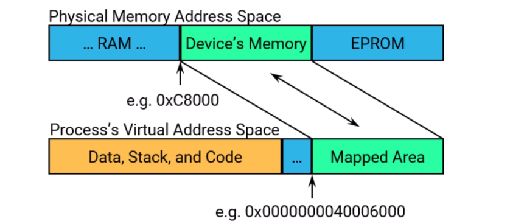
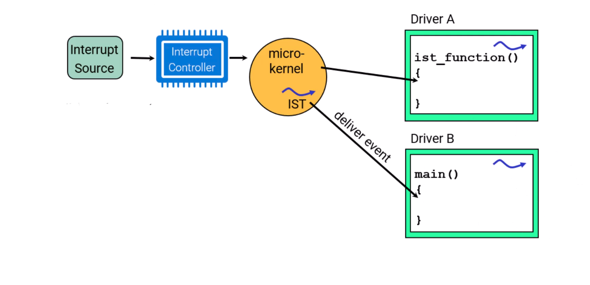
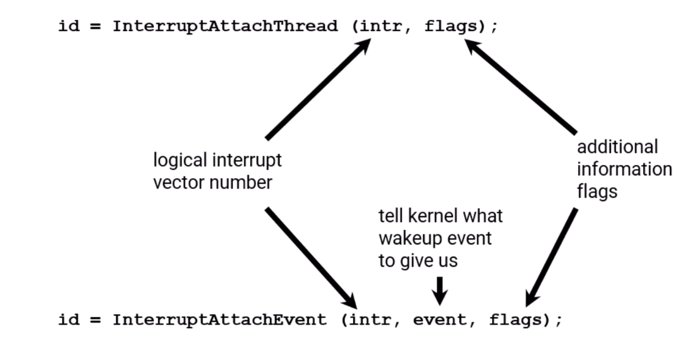

# Hardware Programming

## Hardware IO

### To access memory on a hardware device

physical addresses must be mapped into your process address's virtual address space:


Get a pointer to memory physically ocated at 0xc8000:
`vaddr = mmap (0, Ox4000, PROT_READ | PROT_WRITE | PROT_NOCACHE, MAP_PHYS | MAP_SHARED, NOFD, 0xc8000);`

### DMA operations usually require physically contiguous RAM

``` C++
// for DMA:
// allocate len bytes of physically contiguous system memory
void* vaddr = mmap(0, len, PROT_READ | PROT_WRITE | PROT_NOCACHE, MAP_PHYS | MAR_ANON | MAR_SHARED, NOFD, 0);
// get the physical address for passing to the controller
mem_offset(vaddr, NOFD, len, &paddr, NULL);
```

### How you access control registers varies based on the platform

- on Aarch64 platforms:
  - registers are mapped like memory
  - pointer dereferences are used for read/write operations
- pointers should be declared as pointer-to-volatile
- `procnto` knows based on the system page that these are not RAM, sets hardware access hags differently
  - some x86_64 devices may, also, be accessed this way
- on x86_64 some devices continue to use "x86-style" I/O ports
  - a special address line must be active to change from memory to I/O addressing
  - requires a special set of assembly instructions for access

#### Interfacing to I/O ports (x86_64)

- QNX supplies cover functions for the inline assembly needed

``` C++
#include <hw/inout.h> // header for in*() & out*() fns

// enable I/d privilege for this thread
ThreadCtl(NTO_TCTI__IO_LEVEL, (void *)_NTO_IO_LEVEL_1);

val8 = in8(port);     // read an 8 bit value
val16 = in16(port);   // read a 16 bit value
val32 = in32(port);   // read a 32 bit value
out8(port, val8);     // write an 8 bit value
out16(port, val16);   // write a 16 bit value
out32(port, val32);   // write a 32 bit value
```

## Programming PCI Bus Devices

### To find and configure a PCI device

- you must run the PCI server: `pci-server`

### The PCI calls include

``` C++
pci_device_find()     // find hardware by Device ID and Vendor ID
pri_device_attach()   // find hardware and get basic configuration information
pci_device_reset()    // reset device
pci_device_detach()   // detach device
pci_device_read_*()   // read configuration information
poi_device_write_*()  // write to device command or status register
poi_device_map_as()   // translate between CPU and PCI addresses
poi_device_read_ba()  // store information about the device's supported address spaces
```

#### The `pci_device_find()` call

- fills in a pci_bdf_t base data type
  - encodes the bus, device and function of the PCI device
- various calls can determine
  - interrupt number
  - address translations for bus master PCI devices
  - PCI configuration space registers
  - the base addresses of a device

## Handling Hardware Interrupts

### Interrupt Handling



- all hardware interrupts are vectored to the kernel
- a thread can either:
  - register as an Interrupt Service Thread (IST)
  - request for notification using an event(s), IST(s) will be provided
- the threads run based on priority, scheduling algorithm, ...

### Interrupt calls

``` C++
id = InterruptAttachThread(int intr, unsigned flags);
id = InterruptAttachEvent(int intr, struct sigevent *event, unsigned flags);
InterruptDetach(int id);
InterruptWait(int flags, uint64_t *reserved);
InterruptMask(int reserved, int id);
InterruptUnmask(int reserved, int id);
InterruptDisable(void);
InterruptEnable(void);
```

### The privileges required for interrupt calls

- `InterruptAttachThread()`, `InterruptAttachEvent()`
  - `PROCMGR_AID_INTERRUPT`
- `InterruptDisable()`, `InterruptEnable()`
  - I/O privilege which is gotten by calling: `ThreadCtl(_NTO_TCTL_IO_LEVEL, (void *)_NTO_IO_LEVEL_1)`
    - `PROCMGR_AID_IO`

### Driver A example: Interrupt Service Thread (IST)

``` C++
void ist_function() {
  // ...
  id = InterruptAttachThread(INTNUM, 0);

  for (;;) {
    InterruptWait(0, NULL);
    // do some or all of the work here
    InterruptUnmask(0, id);
    // possibly do more work
  }
}
```

### Driver B example: Requesting an event

``` C++
#define INT_PULSE_CODE (_PULSE_CODE_MINAVAIL+0)

struct sigevent event;
struct _pulse msg;
chid = ChannelCreate(_NTO_CHF_PRIVATE);
self_coid = ConnectAttach(0, 0, chid, _NTO_SIDE_CHANNEL, 0);
SIGEV_PULSE_INIT(&event, self_coid, SIGEV_PULSE_PRIO_INHERIT, INT_PULSE_CODE, 0);

id = InterruptAttachEvent(INTNUM, &event, 0);

for (;;) {
  rcvid = MsgReceive(chid, &msg, ...);
  if (rcvid == 0) {
  // do some or all of the work here
  InterruptUnmask(0, id);
  // possibly do more work
  }
}
```

### Telling kernel what code to run when an interrupt happens



### `InterruptAttach_Thread()`'s and `InterruptAttachEvent()`'s flags

- `_NTO_INTR_FLAGS_NO_UNMASK`: must explicitly unmask the interrupt to enable
- `_NTO_INTR_FLAGS_CPU_LOCAL`: for different interrupt sources that have the same interrupt number on all CPUs:
  - first set the thread's runmask to the CPU, then attach with this flag

### IST or Event?

- an IST is the fastest approach
- with an event, an IST is provided that delivers your event, so two steps
- you can still deliver an event from your IST
  - e.g. notify another thread or a client process via `MsgDeliverEvent()`

You have the following notification methods:

- Interrupt Service Thread (IST)
  - unblocks InterruptWait
  - simplest to use (least setup)
  - fastest (lowest overhead, latency)
  - not queued or counted
  - must dedicate a thread
- `SIGEV_SEM` event
  - unblocks `sem_wait()` on a named semaphore
    - within driver, use an anonymous named semaphore
  - counted
  - the best cross-process choice
- `SIGEV_SIGNAL` event
  - unblocks `sigwaitinfo()`
    - do not use a signal handler, the overhead and latency are awful
  - can be queued
  - can carry data
- `SIGEV_PULSE` event
  - unblocks `MsgReceive*()`
  - queued
  - carries data
  - most flexible
    - single threaded driver can handle hardware and clients
    - pool of threads
  - highest overhead and latency
