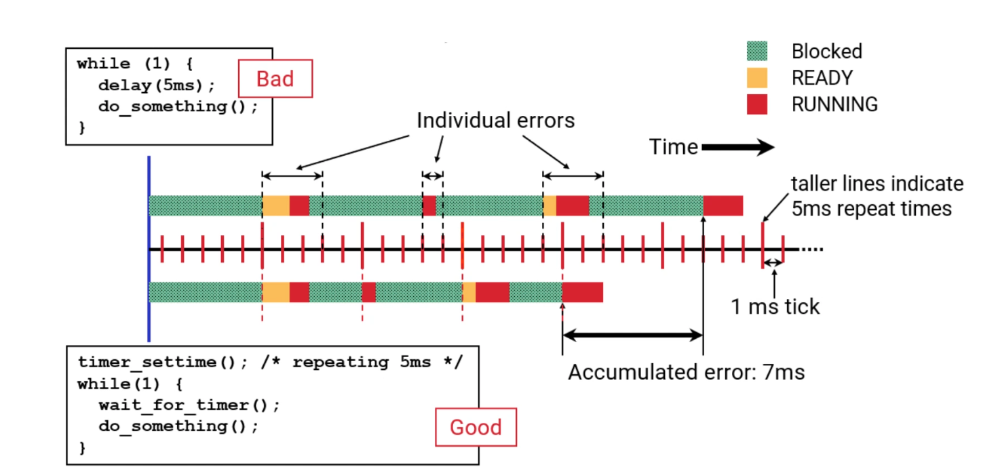

# Timers, Clocks and Timeouts

## Timing Architecture

Time handling has two major parts:

- time
  - what time is it now?
  - driven by hardware-supplied free-running counters
    - often called `ClockCycles()`
- timers
  - get notification after time has passed
  - driven by **core-local**ç timer hardware interrupts that wake up the core-local clock IST
  - default resolution, aka ticksize, of 1 ms

QNX requires access to a free running counter:

- it must be synchronized across all cores
- it must have "good-enough" precision
  - this is generally nanosecond-order resolution
- for application access, we provide a standard interface:
uint64_t ClockCycles (void);
  - despite the style of the function, this is not a kernel call
  - it updates at the rate given by cycles _per_sec available from the system page:

``` C++
#include <sys/syspage.h>
uint64_t cycles_per_sec;
cycles_per_sec = SYSPAGE_ENTRY(qtime)->cycles_per_sec;
```

``` bash
> pidin syspage=qtime
Header size=0x000000f0, Total Size=0x000008d0, Version=2.0, #Cрu=2, Type=4352
Section:qtime offset:0x00000180 size:0x00000068
boot:66ce0aac CPS:000000009a7f728a period/scale:1/-9 intr:2147549184
flags:00000002 epoch:1970 rr_mul:0 adj count/ inc:0/8240000
nsec_inc: 000f4240
nsec_tod_adj:17efa586d500f600 load_max:ffffffffffffffff

> pidin in
CPU: X86_64 Release:8.0.0 FreeMem: 363MB/511MB BootTime:Aug 27 17:19:40 UTC 2024
Processes: 22, Threads: 125
Processor1: 590510 Intel 686 F6M158S10 2592MHz FPU
Processor2: 590510 Intel 686 F6M158S10 2589MHz FPU
```

## Getting and Setting the System Clock

### QNX time representation

- internally handles time as 64-bit nanosecond values
- QNX reports this as two different clocks:
  - `CLOCK_MONOTONIC` which is nanoseconds since boot
    - derived directly from ClockCycles()
  - `CLOCK_REALTIME` which is nanoseconds since Jan 1, 1970
    - derived from `CLOCK_MONOTONIC` plus a stored boot time since Jan 1, 1970
    - often called the "system" time or clock
- POSIX functions uses a `time_t` or `struct timespec`
  - `time_t` is specified as seconds since Jan 1, 1970
- QNX defines a `time_t` as an `int64_t`
  - `struct timespec` is a `time_t`, plus nanoseconds since last second

### For the system time (`CLOCK_REALTIME`)

- `startup` may supply a current-time to the kernel
  - if not, we assume boot time is 0 seconds since the start of time
- after boot, a utility or process may supply a current time, e.g.
  - an `rtc` utility reads a battery-backed hardware clock
  - we may get a network time using NTP, PTP or similar
  - a GPS driver may supply a current time

### Read and/or set the system clock

``` C++
struct timespec tval;
clock_gettime(CLOCK_REALTIME, &tval);
tval.tv_sec += (60*60)*24L; /* add one day */
clock_settime(CLOCK_REALTIME, &tval);
```

- you can read other clocks (e.g. `CLOCK_MONOTONIC`) but not set them
- You must have `PROCMGR_AID_CLOCKSET` to change time

### We can adjust the time

- Bring it forward by one second:

``` C++
struct _clockadjust new, old;
new.tick_nsec_inc = 10000;  // 1e4 ns = 10 us
new.tick_count = 100000;    // 100k * 10us = 1s
ClockAdjust(CLOCK_REALTIME, &new, &old);
```

- Bring it backward by one second:

``` C++
new.tick_nsec_inc = -10000; // 1e4 ns = 10 us
new.tick_count = 100000;    // 100k * 10us = 1s
ClockAdjust(CLOCK_REALTIME, &new, &old);
```

- In both above examples the total adjustment will usually take 100 seconds (100k ticks (for a 1 msec ticksize) = 100 seconds).
- As this changes the system time, it also requires `PROCMGR_AID_CLOCKSET`.

### QNX supplies some convenience functions for dealing with time

- conversion between 64-bit nanoseconds and timespec:

``` C++
uint64_t timespec2nsec(struct timespec *ts);
nsectimespec(struct timespec *ts, uint64_t nsec);
```

- fetching time values in nanoseconds:

``` C++
clock_gettime_ns(clockid_t clock_id, uint64_t *now_ns);
uint64_t clock_gettime_mon_ns(void);
uint64_t clock_gettime_rt_ns(void);
```

## Timers

### Tickless and Ticksize

- QNX timer handling is inherently tickless
  - that is, we only configure timer hardware to generate an interrupt when needed
    - there is no regular timer interrupt
- Ticksize is used to align, or coalesce, timers
  - that is, the hardware timer interrupt, if configured, will usually be configured to align to an integer number of ticks from boot
  - high-resolution timers (HRTs) are the exception

### Ticksize

- this is the resolution of most timers on the system
  - this includes round-robin timeslices, which are 4x the ticksize
  - again, HRTs are the exception to "most"
- the default ticksize is 1ms
  - therefore, the default timeslice is 4ms
  - ticksize can be changed by the -c command-line option to procto
- this means most timing will be based on a resolution of 1 ms
- you can query the current ticksize:

``` C++
struct_clockperiod cp;
ClockPeriod(CLOCK_REALTIME, NULL, &ср, 0);
printf ("current ticksize is su nsecln", cp.nsec);
```

### Normally, timers "round-up" to the ticksize

- let's say we have a thread that's going to sleep for 3.5 ms
  - e.g. `usleep(3500);`
- the thread is never woken up early
  - POSIX says that the time must be at least as long as specified
— the error (diff) will never be more than the ticksize
- when the thread actually runs will depend on scheduling


### Per-CPU Core Timers

Active timers are implemented on a per-core basis:

- when a thread creates a timer:
  - the timer is added to the timer list for the core on which the creating thread is running
  - the core's timer hardware will be configured for when the next timer interrupt is needed
- this distributes the load of servicing timers across the cores in the system
- if you are binding threads to particular clusters using core affinity, program your timers after setting your core affinity
  - this may reduce scheduling latency/overhead when the timers fire

### Timer configuration

To set a timer, the process chooses:

- what kind of timer
  - periodic
  - one shot
- what clock to drive your timer
  - normal system time - `CLOCK_REALTIME`
  - monotonically increasing - `CLOCK_MONOTONIC`
- initial fire time
  - absolute
  - relative
- timer reload/repeat value if periodic
- event to deliver upon trigger
  - fill in an EVENT structure

### POSIX timer functions

- administration
`timer_create(clockID, &event, &timerID);`
`timer_delete(timerID);`
- configuration
`timer_settime(timerID, flags, &newtime, &oldtime);`

#### Example

We want to have the server receive maintenance timer messages every 1.2 seconds, so that it can go out and perform housekeeping duties / integrity checks, etc.


``` C++
typedef union {
  int16_t msg_type;
  struct _pulse pulse;
  // other message types you will receive
} msg_type_t;

msg_type_t msg;

// the setup code from the previous page goes here

while (1) {
  rcvid = MsgReceive(chid, &msg, sizeof(msg), NULL);
  if (rcvid = 0) {
    // it's a pulse, check what type...
    switch (msg.pulse.code) {
    case TIMER_PULSE _CODE:
      periodic_maintenance();
      break;
    }
  }
}
```

You can cancel a timer without destroying it:

- useful if you will frequently be cancelling then restarting it
- to cancel a timer:

``` C++
struct itimerspec itime;
itime.it_value.tv_sec = 0;
itime.it_value.tv_nsec = 0;
timer_settime (timeID, 0, &itime, NULL);
```

- to restart it simply fill in the timing and call `timer_settime()` again

## High-Resolution Timers

- for the initial fire time:
  - timer expiry is not aligned to a tick
  - the timer will fire at or just after the actual expiry time
  - bounded by the resolution of the timing hardware
- the reload/repeat time may be influenced by the tolerance value...

### To configure a high-resolution timer

- make an additional call to `timer_settime()` or `TimerSettime()`
  - as this is completely QNX-specific, it is reasonable to use the kernel call directly here
- pass `TIMER_TOLERANCE` in the flags field
- specify the tolerance in the `itimerspec.it_value` or `_itimer.nsec` fields, respectively
  - the tolerance value must be less than the ticksize
  - this value would matter only for a repeating timer
- the interval for a repeating timer will be the max of your reload/repeat and tolerance
values
- as this imposes extra overhead, it is privileged and requires the PROCMGR AID HIGH RESOLUTION TIMER ability

#### High Resolution Timer Example

Request a pulse in as close to 4.5 ms as possible:

``` C++
struct itimerspec itime;
struct _itimer tolerance;
SIGEV_PULSE_INIT(&sigevent, coid, PRIORITY, TIMER_PULSE_CODE, 0);
timer_create(CLOCK_MONOTONIC, &sigevent, &timerID);

tolerance.nsec = 5; // anything less than the ticksize (usually 1ms)
tolerance.interval_nsec = 0;
TimerSettime(timerID, TIMER_TOLERANCE, &tolerance, NULL) ;
itime.it_value.tv_sec = 0;
itime.it_value.tv_nsec = 4500 * 1000: // 4.5 ms
itime.it_interval.tv_sec = 0;
itime.it_interval.tv_nsec = 0;
timer_settime(timerID, 0, &itime, NULL);
```

## Design Considerations

### Two timing design issues

- how to run periodically without accumulating error
- timer frequency issues which can make timer expiry erratic

### Demonstrate the Issue



### What happens if we ask for a repeating 1.5ms timer?


- we see an actual expiry pattern of: 2ms, 1ms, 2ms,1 ms, 2ms, ...
- the average is correct, and is the best our clock granularity can give.

### So what do you do? There are some choices

- use your own timer hardware/interrupt
- make sure your tick size is quite a bit smaller than the smallest timer period you need
  - smaller ticksizes will impose more system overhead from the kernel handling timer interrupts more frequently
- make your timer expiry an exact multiple of the actual tick size
  - use `ClockPeriod()` to get this value
  - use `CLOCK_MONOTONIC` so that time changes and `ClockAdjust()` don't affect your timing
- use a high-resolution timer
  - also may impose more system overhead

## Kernel Timeouts

### The kernel provides a timeout mechanism

``` C++
#define BILLION 1000000000UL
#define MILLION 1000000
uint64_t timeout;
long status;

timeout = (2 * BILLION) + 500 * MILLION; // Length of time (2.5 seconds)
flags = _NIO_TIMEOUT_SEND | _NIO_TIMEOUT_REPLY; // Which blocking states
TimerTimeout(CLOCK_MONOTONIC, flags, NULL, &timeout, NULL);
status = MsgSend (...); // will time out in 2.5 seconds
if (status == -1 && errno == ETIMEDOUT) {
  // ... // we timed out
}
```

### Some notes on timeouts

- timeout is relative to when `TimerTimeout()` is called
- the timeout is automatically cancelled when the next kernel call returns
  - therefore you should not do anything else between the call to `TimerTimeout()` and the function that you are trying to timeout
- a NULL timeout (rather than a time) says to time out immediately if the call is about to block
