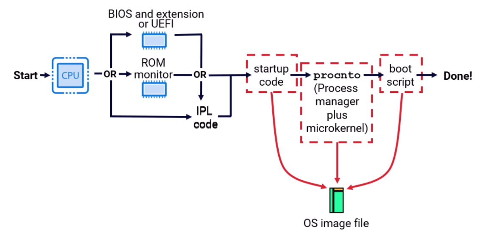
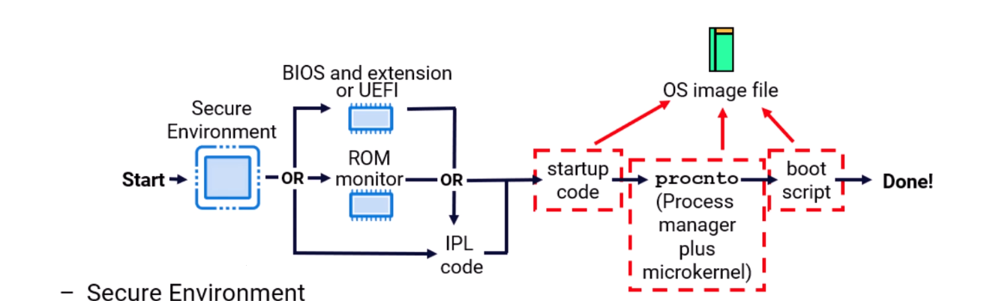
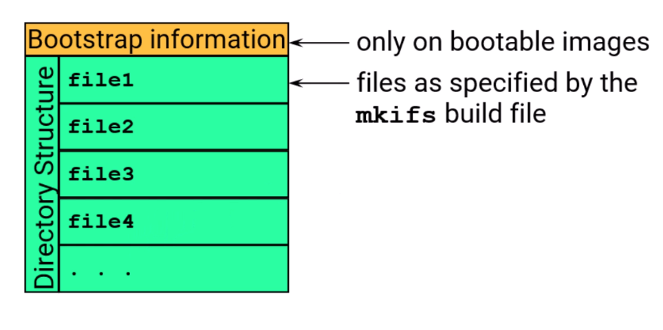
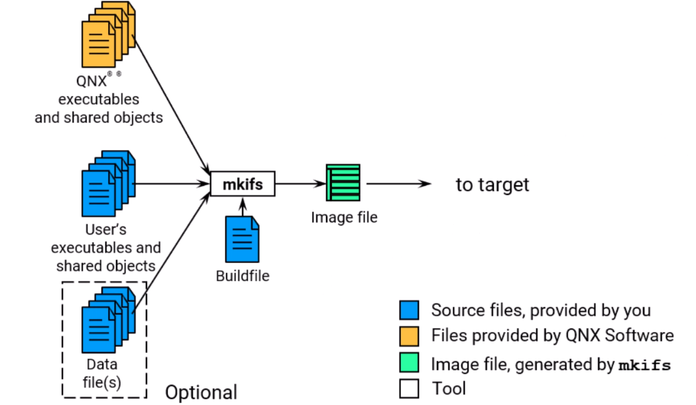
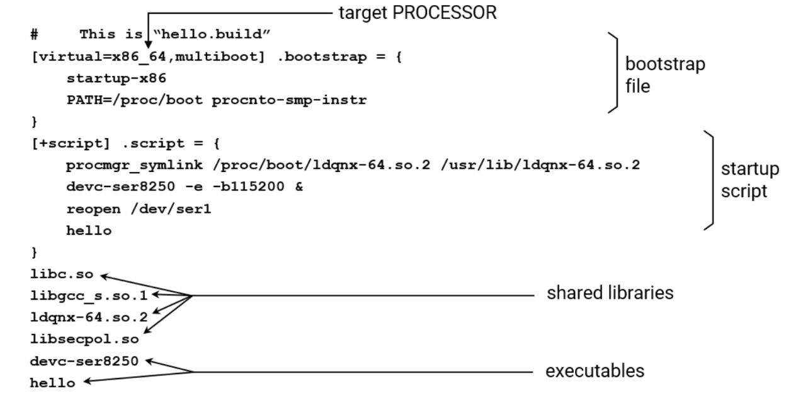

# Build a QNX Neutrino Boot/OS Image - Images & Buildfiles

## Boot Sequence

See [previous page](./1_qnx_architecture.md#boot-sequence)



## Secure Boot Sequence



- Secure Environment
  - validates next stage (usually hash and signature)
  - if validation passes, jumps to next stage
- some variability:
  - usually, entire image validated by secure environment
  - sometimes it verifies the IPL, which then verifies the image
- fs-qtd.so:
  - hashed filesystem extends chain-of-trust past boot to a filesystem

## What is an image

- a file
- contains executables, and/or data files
- can be bootable

### After boot, contents presented as a filesystem

- default: `/proc/boot`
- simple
- read-only
- memory-based

### image file layout



## Images are created by the following



## What is a buildfile?

- a text file that specifies:
  - files / commands that will be included in the image
  - loading options for files & executables.
  - options for creating the image (e.g. compression)
  - for bootable images, a boot script that says what to run after OS initialization

### A buildfile for a bootable image must contain:

- bootstrap loader:
  - `startup-boardname`
- and operating system:
  - `procnto-smp-instr`
- boot script
- executables and shared libraries
  - executables aren't strictly required, but then the system wouldn't actually do anything without them!
  - but, in most cases, to run any executable, you need at least `libc.so`, `libgcc_s.so`, and `ldqnx-64.so`
  - and most QNX supplied services also require `libsecpol.so`

### A sample build file

``` txt
# This is "hello.build"
[virtual=x86_64,multiboot] .bootstrap = {
  startup-x86
  PATH=/proc/boot procnto-smp-instr
}
[+script] .script = {
  procmgr_symlink /proc/boot/1dqnx-64.so.2 /usr/lib/1dgnx-64.so.2
  devc-ser8250 -e -b115200 &
  reopen /dev/ser1
  hello
}
libc.so
libgcc_s.so.1
1danx-64. so.2
libsecpol.so
devc-ser8250
hello
```

### Build an image

To make an image from this, do: `mkifs hello.build hello.ifs`

### Buildfile format

General format of a buildfile:

``` txt
[attribute] filename = contents
[attribute] filename = contents
...
```

- Can include blank lines and comments as well (comments begin with the pound sign, "#")
- All components are optional
  - cannot have contents without a filename

#### Attributes

There are two types of attributes:

- Boolean
  - [+attribute]
    - turns on the specified attribute (e.g. [script])
  - [-attribute]
    - turns off the specified attribute (e.g. [-optional])
- Value
  - [attribute=value]
    - assigns a value to an attribute type (e.g. [uid=0])

Attributes can apply to single files:

- as in the following:

``` txt
[type=link] cat=toybox
[type=link] 15=toybox
```

Or to all subsequent files:

- as in the following:
  
``` txt
[+optional]
file1_which_is_optional
file2_which_is_optional
[-optional]
```

## Adding Files

To add files to your image, list them in your buildfile:

``` txt
devc-ser8250
/etc/hosts = /project_files/target/etc/hosts
```

- find `devc-ser8250` and put it in `proc/boot`
- explicitly supply path for target (`/etc/hosts`) and host (`/project_files/...`)

Or a file can be given in line:

``` txt
readme = {
  This is a handy way to get a file into the image without actually having a file. The file, readme, will be accessible as /proc/boot/readme.
}
```

### Scripts

Using the `[+script]` attribute, a file is treated as a script:

- It will be executed after the process manager has completed its startup.
- Multiple scripts will be concatenated into one and be interpreted in the order given.
- There are modifiers that can be placed before commands to run:
  - Example: `[pri=27f] esh`
- There are also some builtin commands:
  - Example: `reopen /dev/con1`

#### Example script

``` txt
[+script] .script = {
  procmgr_symlink /proc/boot/Idqnx-64.so.2 /usr/lib/Idqnx-64.5o.2

  display_msg Starting character drivers
  devc-ser8250 -e -b115200 &
  devc-pty -n 16 &
  devc-con &

  waitfor /dev/ser1 # don't continue until /dev/serl exists

  display_msg Setting up consoles

  reopen /dev/con2 # set stdin, stdout and stderr to /dev/con2
  [+session pri=27r] PATH=/proc/boot esh &
  reopen /dev/con1 # set stdin, stdout and stderr to /dev/con1
  [+session pri=10r] PATH=/proc/boot esh &
}
```

#### Internal commands are

- ones that mkifs recognizes and are not loaded from the host's filesystem:
  - `display_msg` outputs the given text
  - `procmgr_symlink` is the equivalent of `ln -P`, except that you don't have to have `ln` present
  - `reopen` causes `stdin`, `stdout`, and `stderr` to be redirected to the given filename
  - `waitfor` waits until a `stat()` on the given pathname succeeds
- there are no testing, branching, or looping constructs
  - more complicated initialization should be done through scripts or programs

### Buildfile explained



### Search paths

To find files, mkifs, looks in:

``` txt
${QNX_TARGET}/${PROCESSOR}/bin, ../usr/bin, ../sbin, ../usr/sbin  # binaries (esh, 1s, etc)
§{QNX_TARGET}/${PROCESSOR}/boot/sys                               # OSes (procto, etc)
§{QNX_TARGET}/${PROCESSOR}/1ib, ../usr/lib                        # libraries and shared objects
§{QNX_TARGET}/${PROCESSOR}/lib/dil                                # shared objects
```

- The above can be overridden:
  - using the `MKIFS_PATH` environment variable: `MKIFS_PATH=/usr/nto/x86/bin:/usr/nto/x86/sys:/usr/nto/86/dll:/usr/nto/x86/lib:/project/bin`
    - most BSPs modify this
  - using the `search` attribute for a particular file: `[search={MKIFS_PATH}:/project/bin] myexec`
