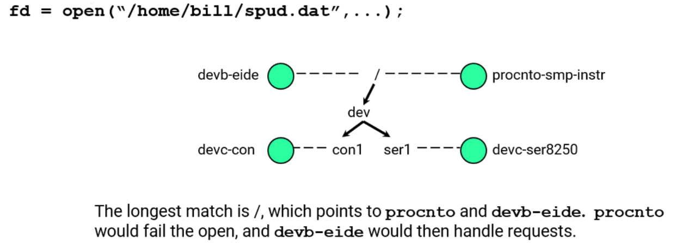

# Resource Managers

## Overview of Resource Managers

### What is a resource manager?

- a program that looks like it is extending the operating system by:
  - creating and managing a name in the pathname space
  - providing a POSIX interface for clients (e.g. `open()`, `read()`, `write()`, ...)
- can be associated with hardware (such as a serial port, or disk drive)
- or can be a purely software entity (such as queuing or logging)

### Pathname space


The prefix tree:

- is the root of the pathname space
  - every name in the pathname space is a descendant of some entry in the prefix tree
- is maintained by the Process Manager
- Resource Managers add and delete entries
- associates a `pid`, `chid`, and `handle` with a name
- is searched for the longest slash-delimited whole-word matching prefix

- The mapping can be observed / debugged by looking into path `/proc/mount`


#### Example: open `/home/bill/spud.dat`



### When a client requests a service

``` C++
fd = open("/dev/ser1", O_RDWR);
// or
fp = fopen("/home/bill/abc", "w");
// or
mg = ma open("/myqueue", O_RDONLY);
```

which results in the client's library code sending a message to the process manager...

### opening a resource manager


1. `open()` sends a "query" message
2. Process Manager replies with who is responsible (`pid`, `chid`, `handle`)
3. `open()` establishes a connection to the specified resource manager (`pid`, `chid`), and sends an open message (containing the handle)
4. resource manager responds with status (pass/fail)

- All further communication goes directly to the resource

### Resource managers are built on message passing


1. client calls the POSIX `write()`
2. this builds and sends a message
3. the resource manager receives and processes the `write` message appropriately
4. the resource manager replies with a result and this is returned to the client from `write()`

### A resource manager performs the following steps

- creates a channel
- takes over a portion of the pathname space
- waits for messages & events
- processes messages, returns results

### There are three major types of messages

- Connect messages:
  - pathname-based (eg: `open("spud. dat", ...)`)
  - may create an association between the client process and the resource manager, which is used later for I/O messages
- I/O messages:
  - file-descriptor- (`fd`-) based (eg: `read(fd, ...)`)
  - rely on association created previously by connect messages
- Other:
  - pulses, private messages, etc

### Resource manager messages

- Defined in `<sys/iomsg.h>`

#### Connect Messages

- have a type of `_IO_CONNECT`
- differentiated by subtype:

``` C++
// client call        message
    open()        // _IO_CONNECT_OPEN
  unlink()        // _IO_CONNECT_UNLINK
  rename()        // _IO_CONNECT _RENAME

#include <sys/iomsg.h>
```

#### I/O Messages

- all have different message types:

``` C++
// client call        message
    read()          // _IO_READ
    write()         // _IO_WRITE
    close()         // _IO_CIOSE
devctl(), ioctl()   // _IO_DEVCTI

#include <sys/iomsg.h>
```

#### Other I/O messages

``` C++
_IO_NOTIFY,
_IO_STAT,
_IO_SPACE,
_IO_PATHCONF,
_IO_ISEEK,
_IO_CHMOD,
_IO_CHOWN,
_IO_UTIME,
_IO_OPENED,
_IO_EDINFO,
_IO_LOCK,
_IO_TRUNCATE,
_IO_SHUTDOWN,
_IO_DUP,
```

### resource-manager library

Writing resource managers is simplified greatly with a resource-manager library that:

- simplifies main receive loop (table-driven approach)
- has default actions for all message types


Message-handling functions:

- may access client data
  - data already in the receive buffer
  - get more data if necessary
- must either:
  - reply to the client with:
    - an error
    - a success status without data
    - a success status and data
- or:
  - delay responding to the client until later

## The Example Resource Manager

To talk about setting up a resource manager, we'll use an example resource manager:

Client side:

- Here's how it behaves from a client's point of view:
  - read always returns 0 bytes write of any size always works
  - other things behave as expected
- create & initialize structures:
  - a dispatch structure
  - list of connect message handlers
  - list of I/O message handlers
  - device attributes
  - resource-manager attributes
  - dispatch context
- attach a pathname, passing much of the above
- from the main loop:
  - block, waiting for messages
  - call a handler function; the handler function handles requests and performs callouts to your specified routines.

### Breaking down

#### Dispatch structure

``` C++
dispatch_t *dpp;
dpp = dispatch_create_channel(chid, flags);
```

- this is the glue the resource manager framework uses to hold everything together
- the contents are hidden (it is an opaque type)
- This is usually called with the parameters: `dispatch_create_channel(-1, DISPATCH_FLAG_NOLOCK);`
  - create a channel
  - disable some, usually unnecessary, mutex locks during message handling

#### Set up two tables of functions

- connect functions
  - these are called as a result of POSIX calls that take a filename e.g.: `open(filename, ...)`, `unlink(filename)`, ...
- I/O functions
  - these are called as a result of POSIX calls that take a file descriptor e.g.: `read(fd, ...)`, `write(fd,...)`, ...


``` C++
resgr_connect_funcs_t connect_funcs;
resngr_io_funcs_t     io_funcs;
iofunc_func_init(_RESMGR_CONNECT_NFUNCS, &connect_funcs, RESMGR_IO_NFUNCS, &io_funcs);

connect_funcs.open =  io_open;
io_funcs.read =       io_read;
io_funcs.write =      io_write;
```

`iofunc_func_init()` places default values into the passed connect- and I/O- functions structures, based on the number of values that you have specified via the first and third integer arguments. It is recommended that you use the `_RESMGR_CONNECT_NFUNCS` and `_RESMGR_IO_NFUNCS` constants for those two arguments.

#### Fill the device-attributes structure

- for passing to `secpol_resmgr_attach()`

``` C++
iofunc_attr_t ioattr;
lofunc_attr_init(&ioattr, S_IFCHR | 0666, NULL, NULL);
```

- this is your device-specific data structure
- used by the `iofunc_*()` helper functions
- it is possible to extend this structure so that it can contain your own data too

#### Attaching to pathname space


`secpol_resmgr_attach(..., "/dev/example",...);`
or, in older resource managers, you may see: `resmgr_attach(..., "/dev/example", ...);`

#### Pass the structures to `secpol_resmgr_attach()`

``` C++
id = secpol_resmgr_attach(&secpol_handle, dpp, &rattr, path, file_type, flags, &connect_funcs, &io_funcs, &ioattr, &perms_set);

/*
Parameters:
secpol_handle               usually NULL
dpp                         pointer returned by dispatch_create_channel
rattr                       usually NULI, or structure of further parameters
path                        "/dev/example"
file_type                   usually _FTYPE_ANY
flags                       usually 0, or control flags...
connect_funcs and io_funcs  point to the tables of functions we just created
ioattr                      pointer to device attributes
perms_set                   usually NULL

Returns:
id                          id of this pathname, used for resmgr_detach call
*/
```

#### When you call `secpol_resmgr_attach()`, you are

- Creating your device
- Associating data and handlers with it
- The library does not make copies of these structures


#### `secpol__resmgr_attach()` puts the name in the pathname space.

- you look like "part of the OS", so this is privileged:
  - requires `PROCMGR_AID_PATHSPACE`
- your resource manager becomes visible to clients
  - clients will expect you to be ready to handle messages
- so, before doing so, you should have completed most of your initialization:
  - hardware detection and initialization
  - buffer allocation and configuration
- if something fails, don't attach name

#### `secpol_resmgr_attach()` may update your attribute structure

- based on the security policy, it may:
  - set ownership (`uid`, `gid`)
  - set permissions
  - add Access Control Lists (ACLs)
- this gives a system integrator control over access to devices through the security policy
- if you want to know if changes were made:
  - pass the address of a boolean for the `perms_set` parameter
  - it will be set to `true` if changes were made, or `false` if not

#### Lastly, allocate a dispatch context structure

``` C++
dispatch_context_t *ctp;
ctp = dispatch_context_alloc(dpp);
```

- this is the operating parameters of the message receive loop
- it is passed to the blocking function and the handler function
- it contains things like the `rcvid`, pointer to the receive buffer, and message info structure
- it will be passed as the `ctp` parameter to your connect and I/O functions

### Putting together what we have so far

``` C++
dpp = dispatch_create_channel(-1, DISPATCH_FLAG_ NOLOCK);
iofunc_func_init(_RESMGR_CONNECT_NFUNCS, &connect_funcs, _RESMGR_IO_NFUNCS, &io_funcs);
connect_funcs.open = io_open;
io_funcs.read = io_read;
io_funcs.write = io_write;
iofunc_attr_init(&ioattr, S_IFCHR | 0666, NULL, NULL);
id = secpol_resmgr_attach(NULL, dpp, NULL, "/dev/example", 0, &connect_funcs, &io_funcs, &ioattr, NULL);
ctp = dispatch_context_alloc(dpp);

while (1) {
  dispatch_block(ctp);
  dispatch_handler(ctp);
}

```

- `dispatch_block()` blocks waiting for messages,
- `dispatch_handler()` handles them, including calling any callout functions which you've provided (connect function, I/O functions)

## Handling `read()` and `write()` -- `read()`

### What happens when a client uses the `/dev/example` device

For example, doing `cat /dev/example`

Internally, `cat` basically does:

``` c++
fd = open("/dev/example", _RDONLY);
while (read(fd, buf, BUFSIZ) > 0) {
  /* write buf to stdout */
}
close(fd);
```

Which results in:

- Communications with the Process Manager:
  - an inquiry message to the process manager:
    - "who is responsible for `/dev/example`?"
    - returns a reply, "(`pid`, `chid`)" (our resource manager, `example`), "is responsible"
- Communications with `example`:
  - an open message
    - "open this device for read"
    - returns a reply, "yes, open succeeded, proceed"
    - the open library call returns a file descriptor, `fd`
  - a read message
    - "get me some data"
    - returns a reply, "here are O bytes" (I.e. EOF)
  - a close message

### example's I/O functions:

``` C++
int    io_read(resmgr_context_t *ctp,
               io_read_t *msg,
               RESMGR_OCB_T *ocb);
int   io_write(resmgr_context_t *ctp,
               io_write_t *msg,
               RESMGR_OCB_T *ocb) ;
```

- `msg` is always a pointer to the current message being handled
- They both share the `ctp` and `ocb`...

### I/O Functions Arguments -- `ctp`

- pointer to a resource-manager context structure
- information about the received message
- contains at least:

``` C++
typedef struct _resmgr_context {
  revid_t               revid;
  struct _msg_info      info;
  resngr_iomsgs_t*      msg;
  size_t                msg_max_size;
  size_t                offset;
  size_t                size;
 } resngr_context_t;
 ```

### I/O Functions Arguments -- `ocb`

- Open Control Block
- one `ocb` per `open()`
- maintains context between the `open()` call and subsequent I/O calls, i.e.` iofunc_open_default()` allocates and initializes it, I/O functions use it.
- will be either an `iofunc_ocb_t`, or
- an `iofunc_ocb_t` encapsulated within your own structure with additional state information, etc.
- points to the attribute structure for the device opened


### `read()`, client side

A client's read() call might look like:
`bytes_read = read(device_fd, &buffer, bytes_wanted);`

- and the expected results would be:
  - returns `-1` and sets errno on failure
  - for a file-like device, returns `0` to indicate end-of-file (EOF)
  - returns data:
    - fills `buffer` with between `1` and `bytes_wanted` bytes
    - returns the number of bytes copied into `buffer`
  - if `bytes_wanted` is 0, returns `0` if the client is allowed to read from the device (and failure if not)

### `read()`, `QNX`, `libc`

The message will be generated by the `read()` call which looks like:

``` C++
ssize_t read( int fd, void *buf, size_t nbytes )
{
  struct _io_read hdr;
  hdr.type = _IO_READ;
  hdr.xtype = _IO_XTYPE_NONE;
  hdr.nbytes = nbytes;
  // ...
  return MsgSend(fd, &hdr, sizeof(hdr), buf, nbytes);
}
```

### `read()`, the message

The message you'll receive is:

``` C++
typedef union
{
  struct _io_read i;
} io_read_t;

struct _io_read
{ // contains at least the following
_Uint16t    type;   // message type = _IO_READ
_Uint32t    xtype;  // extended type
_Uint32t    nbytes; // number of bytes to be read
};
```

### `read()`, replying

``` C++
MsgReply(ctp->rcvid, bytes_read, buffer, bytes_read);
return _RESMGR_NOREPLY;
```

- if successful:
  - the reply message (buffer, bytes_read) would be your data (i.e. there is no header to worry about)
  - the `MsgReply()` status would be the return value from the client's `read()`, the number of bytes successfully read
- if failed, do:
`return errno_value;`
  - the library will `MsgError(ctp->cvid, errno_value)` causing the client's `read()` to return -1 with errno set to `errno_value`

### the `xtype` field

The `xtype` (extended-type) member:

- will most often be: `_IO_XTYPE_NONE`
- most `read()` and `write()` hendlers check for `_IO_XTYPE_NONE`. if `xtype` is not this, then they return `ENOSYS`

### example's `read()` handler:

``` C++
int io_read(resmgr_context_t *ctp, io_read_t *msg, RESMGR_OCB_T *ocb)
{
  int status;
  if ((status = iofunc_read _verify(ctp, msg, ocb, NULL)) != EOK) {
    return status;
  }
  if ((msg->i.xtype & _IO XTYPE_MASK) !=_IO_XTYPE_NONE) {
    return ENOSYS;
  }
  MsgReply(ctp->rovid, 0, NULL, 0);
  /* O bytes successfully read */
  if (msg->i.nbytes > 0) { /* mark access time for update */
    ocb->attr->flags |= IOFUNC_ATTR_ATIME;
  }

  return _RESMGR_NOREPLY;
```

## Handling `read()` and `write()` -- `write()`

### `write()` - Client side

A client's write call might look like:

``` C++
bytes_written = write(device_fd, &buffer, out_bytes);
```

- and the expected results would be:
  - returns -1 and sets errno on failure
  - outputs data:
- outputs between 1 and out_bytes bytes from buffer
- returns the number of bytes output
  - if (and only if) out_bytes is 0, returns 0 if the client is allowed to write to the device (and failure if not)
    - there is no return of 0 at EOF
    - a write at EOF either grows the file, or fails (e.g. device full)

### `write()` - libc

The message will be generated by the `write()` call, which looks like:

``` C++
ssize_t write(int fd, const char *buf, size_t nbytes) {
  struct io_write hdr;
  iov_t iov[2];
  hdr.type = _IO_WRITE;
  hdr.nbytes = nbytes;
  // ...

  SETIOV(&iov[0], &hdr, sizeof(hdr)) ;
  SETIOV(&iov[1], buf, nbytes);
  return MsgSendv(fd, iov, 2, NULL, 0);
}
```

### `write()` - the message

The message you'll receive is:

``` C++
typedef union
{
  struct _io_write i;
} io_write_t;
/* the data to be written usually follows the io_write_t */

struct _io_write
{ // contains at least the following
  unsigned short  type;         // message type =_ IO_WRITE
  long            nbytes;       // number of bytes to write
  uint32_t        xtype;        // extended type
};
```

### `write` - replying

For the reply:

- if successful:

``` C++
MsgReply(ctp->rcvid, bytes_written, NULL, 0);
return _RESMGR_NOREPLY;
```

  - there is no data to reply with
  - the `MsgReply()` status would be the return value from the client's write, the number of bytes successfully written
    - `write()` only returns 0 bytes written for a `write()` of 0 bytes
- if failed, do: `return errno_value;`

### `write()` example

example's `write()` handler

``` C++
int io_write(resmgr_context_t *ctp, io_write_t *msg, RESMGR_OCB_T *ocb)
{
  int status;
  if ((status = jofunc_write_verify(ctp, msg, ocb, NULL)) != EOK) {
    return status;
  }
  if ((msg->i.xtype & _IO XTYPE_MASK) != _IO_TYPE_NONE) {
    return ENOSYS;
  }

  // msg->i.nbytes is the number of bytes to be written,
  // we are telling it that we wrote everything (msg->i.nbytes)
  MsgReply(ctp->rcvid, msg->i.nbytes, NULL, 0);

  if (msg->i.nbytes > 0) /* mark times for update */ {
    ocb->attr->flags |= IOFUNC_ATTR_MTIME | IOFUNC_ATTR_CTIME;
  }
  return _RESMGR_NOREPLY;
}
```

### `write()` - getting the data

example doesn't do anything with the data to be written, but what if you want to?

- the data usually follows the io _write_t in the message buffer.
- but it may not all have been received, what happens in the following case?


As you know, the kernel copies the lesser of the two sizes, so in this case only 1000 bytes will have been received. How do you handle this?

You need to:

- figure out where to put the data
  - pre-allocated ring buffer
  - hardware cache buffers
  - allocate a buffer
- put the data where it goes:
  - for a single destination buffer:
    - `resmgr_msgget()`
  - for multiple destination buffers:
    - `resmgr_msggetv()`

#### getting the data - `resmgr_msgget()`

Get client data with:

``` C++
bytes_copied = resmgr_msgget(ctp, buf, bytes, offset);
```

- copy `bytes` of data from client `ctp->rcvid`
- starting at `offset` bytes after the start of `msg`
  - remember, `msg` is a standard parameter to our I/O functions
- to `buf`
- copies locally if possible
- calls `MsgRead()` when needed
