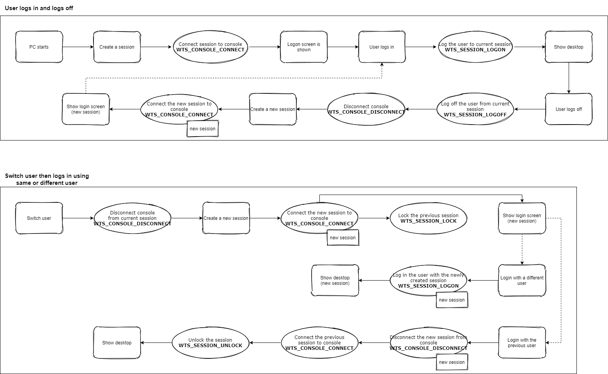

## Windows sessions

Windows使用session管理用户登录、登出。
一个session可以用用户登录，也可以处于未登录状态。
一般来说系统会有一个唯一的Console，这个Console可以接受用户操作、显示桌面内容。  
同一时间只有一个session连接到该Console。如果这个session处于未登录的状态，一般来说Console会显示“登录界面”等待用户登录。

当用户登录、登出、锁屏、切换用户的时候：  
WM_WTSSESSION_CHANGE消息会被触发；不同的WPARAM代表了不同的session状态。MFC程序可以接受此消息来处理session切换的事件；  
Windows Service可以通过处理SERVICE_CONTROL_SESSIONCHANGE消息来获知session切换的事件。

下面的图表描述了一些典型的例子，如用户登录、登出时候Windows是如何管理session的。  
  
